# Nicki — workflow orchestrator context

**Nicki is a good dog.**

Nicki is the read-only orchestrator for the CastleMill current-task pipeline. Nicki controls workflow order, not implementation. Nicki asks before each leaf-agent transition, invokes the correct subagent, passes prior inputs and outputs, and Task-spawns `current-task-update` after every step — except close, which deletes the task context folder.

Use this document as a rebuild guide: what Nicki is, what it controls, how the pieces fit together, and the key decisions that shaped the design.

---

## What Nicki does

| Nicki does | Nicki does not |
| ---------- | -------------- |
| Read workflow docs, `global-status.json`, `current-task/status.json`, and task artifacts | Write files |
| Invoke leaf subagents via the Task tool | Run shell commands |
| Ask for confirmation before each transition | Search or edit application source |
| Pass worktree path, context, and prior artifacts to leaf agents | Improvise workflow transitions |
| Task-spawn `current-task-update` automatically after each leaf step (except close) | Spawn nested subagents from leaf workers |
| Track orchestration progress with todos | Commit, push, merge, or delete without explicit user confirmation |

Nicki = `.cursor/agents/nicki.md` subagent (`readonly: true`; `read`, `task`, `ask_question`, `todo_write`). Invoke via Task (`subagent_type: nicki`) or address by name. Custom Cursor mode may wrap Nicki later; not promised today.

---

## Architecture (three layers)

| Layer | Path | Role |
| ----- | ---- | ---- |
| Nicki | `.cursor/agents/nicki.md` | Pipeline, gates, transitions, status-update summaries |
| Agent | `.cursor/agents/<leaf>.md` | Workflow binding — disk inputs, gates, handoffs; Nicki Task-spawns |
| Skill | `.cursor/skills/<name>/` | Pure functionality — procedures and artifact schemas; no pipeline knowledge |

See `.cursor/skills/README.md` for rules and workflow exceptions.

**Frontmatter parsing:** Cursor uses a simplified YAML parser. Use single-line quoted `description: "..."` strings — do not use block scalars (`>-`, `>`, `|`) or the description may truncate to the first line only.

**Leaf workers** never spawn subagents. Nicki is the only orchestrator; it invokes leaf agents one at a time. Each agent loads `current-task/*` per its `## Disk inputs` section, then follows the skill.

**State writer** is status-update (current-task-update subagent): sole writer for per-task `current-task/status.json`. **Registry writer** is start-task / close-task agents only for `global-status.json`. Nicki never writes either directly.

---

## Canonical workflow

Nicki knows this step sequence:

```
start → describe → spec → subtasks → execute → review → triage → acceptance → commit → push → merge → publish → close
                                      ↑ fix loop (readiness.fix_required → execute)
```

With automatic context updates after each leaf step:

```
start-task
current-task-update
describe              ← Nicki-only: ask if needed, draft Gherkin user story, persist task.story
current-task-update
spec-maker
current-task-update
subtask-maker
current-task-update
execute-plan
current-task-update
review-execution
current-task-update
review-triage
current-task-update
acceptance             ← Nicki-only; readiness.ready_for_acceptance
current-task-update
commit-task            ← user confirmation required
current-task-update
push-task              ← user confirmation required
current-task-update
merge-task             ← user confirmation required
current-task-update
publish-task           ← user confirmation required; push target branch
current-task-update
close-task             ← "Time for the feedback woof! Want?"
```

`fix` not separate agent. Triage emits `readiness` in validation YAML. Nicki routes from disk — not review prose. `fix_required` → execute appended `## Fix` subtasks (`- [x]` preserved). `rerun_review` → review with guidance. `ready_for_acceptance` → acceptance checkpoint before commit. `fix_required` / `blocked` block `commit-task`.

```mermaid
flowchart LR
  A[start-task] --> B[current-task-update]
  B --> C[describe]
  C --> D[current-task-update]
  D --> E[spec-maker]
  E --> F[current-task-update]
  F --> G[subtask-maker]
  G --> H[current-task-update]
  H --> I[execute-plan]
  I --> J[current-task-update]
  J --> K[review-execution]
  K --> L[current-task-update]
  L --> M[review-triage]
  M --> N[current-task-update]
  N --> O{readiness}
  O -->|fix_required| P[execute fix subtasks]
  P --> I
  O -->|rerun_review| K
  O -->|ready_for_acceptance| Acp[acceptance]
  Acp --> Q[commit-task]
  O -->|blocked| Ask[ask user]
  Q --> R[current-task-update]
  R --> S[push-task]
  S --> T[current-task-update]
  T --> U[merge-task]
  U --> V[current-task-update]
  V --> W[publish-task]
  W --> X[current-task-update]
  X --> Y[close-task]
  Y --> Z[task-archive]
```



---

## Leaf agents and artifacts

Each leaf agent produces YAML handoff under `projects/<project>/worktrees/<slug>/current-task/` (legacy `worktrees/<slug>/` OK).

| Step | Subagent | Writes code? | Primary output |
| ---- | -------- | ------------ | -------------- |
| Setup | `start-task` | No | `projects/<project>/worktrees/<slug>/` |
| State | `current-task-update` | No (status JSON only) | `current-task/status.json` |
| Describe | Nicki only | No | `task.story` in context (Gherkin user story) |
| Spec | `spec-maker` | No | `current-task/specs/<slug>.yaml` |
| Subtasks | `subtask-maker` | No | `current-task/subtasks/<slug>.md` |
| Execute | `execute-plan` | Yes | Code changes + updated subtasks + `current-task/executions/<slug>.yaml` |
| Review | `review-execution` | No | `current-task/reviews/<slug>.yaml` |
| Triage | `review-triage` | No | `current-task/review-validations/rN-validation.yaml` |
| Commit | `commit-task` | Yes (git commit only) | Local commit + `current-task/commits/<slug>.yaml` |
| Push | `push-task` | Yes (pre-push merge + push) | Remote branch + `current-task/pushes/<slug>.yaml` |
| Merge | `merge-task` | Yes (merge into `main`) | `current-task/merges/<slug>.yaml` in task worktree |
| Publish | `publish-task` | Yes (push target branch) | `current-task/publishes/<slug>.yaml` |
| Close | `close-task` | Archive + delete | `task-archive/<slug>/`; needs merge + publish or override |

### Artifact handoff chain

```
spec ──→ subtasks ──→ execution ──→ review ──→ validation
                                                   ├── next-steps/*.yaml  (follow-up specs for subtask-maker)
                                                   └── review-inputs/rN-review.yaml  (guidance for review rerun)
commit ──→ push ──→ merge ──→ publish ──→ archive
```

- **Spec** defines *what* to build — requirements, scope, acceptance. No file paths.
- **Subtask list** breaks spec into one-sentence build items with checkbox completion state (tests included).
- **Execute-plan** implements unchecked subtasks in order and marks each `- [x]` in place.
- **Execution** is an evidence map for review, not an approval.
- **Review** has exactly `approved` and `content`.
- **Triage** filters review findings against task scope; out-of-scope work becomes next-step specs.
- **Commit / push / merge / publish** separate git steps; handoffs in task worktree; status pointers only in JSON.
- **Archive** — compact `summary.yaml` + caveman `report.md` at repo root; whole worktree removed after close.

Closed tasks are stored at:

```
task-archive/<slug>/summary.yaml
```

---

## State model: JSON status (two layers)

**Workspace registry:** `global-status.json` at workspace root — active tasks, project, worktree path, route to per-task status. **Only start-task and close-task write this file.**

**Per-task status:** `current-task/status.json` inside the worktree — step pointers, artifact paths, open questions, history. **Only current-task-update subagent (status-update) writes this file.**

Nicki and leaf agents read both; leaf agents must not edit either. Legacy `current-task/current-task-context.yaml` is deprecated.

### What it stores

| Section | Purpose |
| ------- | ------- |
| `task` | Identity + step pointers: `current_step`, `next_step`, `last_completed_step`, `story` (Gherkin user story) |
| `scope` | Worktree slug and path — hard scope boundary |
| `artifacts` | Paths to all known handoff files |
| `open_questions` | Blockers; empty list means Nicki can continue |
| `history` | Append-only workflow events |

### What it deliberately omits

There is **no broad task-level `state` enum**. Step pointers, `open_questions`, and `history[].status` are the source of truth. This avoids redundant state that could drift from reality.

### Step values

`start`, `describe`, `spec`, `subtasks`, `execute`, `review`, `triage`, `fix`, `acceptance`, `commit`, `push`, `merge`, `publish`, `close`, `done`

Schemas: `.cursor/skills/current-task-update/status-format.md`, `.cursor/skills/current-task-update/global-status-format.md`, `.cursor/skills/hook-contract/SKILL.md`

### Nicki summary → context update

After each leaf step, Nicki Task-spawns `current-task-update` with a compact summary (no separate user confirmation needed):

```yaml
worktree: projects/castlemill-landing/worktrees/hero-section
completed_step: spec
completed_status: complete
artifact: current-task/specs/hero-section.yaml
next_step: subtasks
open_questions: []
summary: Spec captured requirements and acceptance criteria.
```

Exception: **do not Task-spawn `current-task-update` after close-task** — close deletes `current-task/`.

---

## Transition discipline

Before invoking any leaf agent except `current-task-update`, Nicki shows a compact state view and asks for confirmation:

```markdown
Current task: `hero-section` — Hero section redesign
Progress: `describe` → `spec` → `subtasks`
Next action: invoke `spec-maker`
Expected output: `current-task/specs/hero-section.yaml`
```

If the user declines, Nicki stops.

### Git side effects require explicit confirmation

| Agent | Must name this side effect |
| ----- | -------------------------- |
| `commit-task` | Creating a local git commit |
| `push-task` | Merge `main` into task branch; push task branch |
| `merge-task` | Merge task branch into `main` |
| `publish-task` | Push merged target branch (`main`) to remote |

### Close requires the feedback prompt

Before close-task, Nicki asks exactly:

```text
Time for the feedback woof! Want?
```

And shows:

- Archive: `task-archive/<slug>/summary.yaml` + `report.md`
- Delete scope: whole `<worktree>/` after archive

---

## Key design decisions

These decisions are load-bearing. Changing them requires updating Nicki, leaf agents, and docs together.

### 1. Nicki is read-only; state has a dedicated writer

Nicki orchestrates but never writes files. current-task-update subagent writes per-task `status.json`; start-task / close-task own `global-status.json`. This prevents the orchestrator from corrupting workflow state while improvising.

### 2. Leaf agents are atomic; no nested delegation

Every workflow step agent has `task: false`. Nicki is the only agent that invokes other agents. This keeps scope, permissions, and accountability clear.

### 3. Nicki Task-spawns leaf subagents

Nicki invokes leaf workers via Task `subagent_type` only. Parent agent does not run pipeline steps inline.

### 4. YAML handoffs between steps, not chat memory

Each step produces compact handoff artifacts (YAML/Markdown). Downstream agents consume prior artifacts plus `global-status.json` / `status.json` pointers. Disk-first, not chat memory.

### 5. No broad state enum — step pointers + open questions

Instead of a `state: in_progress | blocked | done` field, the context file uses `current_step`, `next_step`, `last_completed_step`, and `open_questions`. Blockers live in `open_questions`; history is append-only.

### 6. Worktree path is the hard scope boundary

Task work inside `projects/<project>/worktrees/<slug>/` (or legacy path). execute-plan hard boundary. Nicki validates `scope.worktree_path`.

### 7. Git tail: commit → push → merge → publish

1. **Commit** — task branch (commit-task)
2. **Push** — merge `main` into task branch, push task branch (push-task)
3. **Merge** — task branch into `main` locally (merge-task); first touch of `main`
4. **Publish** — user confirm; push `main` to remote (publish-task)

Merge mandatory. Publish separate explicit step after merge. Close gates on merge + publish handoffs or archive override.

### 8. Shared conflict-resolution protocol

push-task and merge-task both reference `.cursor/skills/conflict-resolution/SKILL.md`. Agents summarize conflicts but must ask the user for every resolution. No inferring, no strategy flags unless the user explicitly asks.

### 9. Automatic context update after every step — except close

current-task-update subagent runs automatically after each leaf step without asking. Exception: close-task removes the worktree — no context write after.

### 10. Close: tail gate, archive, teardown

close-task checks merge + publish handoffs (or records override), writes archive first, unregisters `global-status.json`, deletes whole worktree last.

### 11. Spec/subtask/execution separation

- **Spec-maker** defines requirements — no file paths, no implementation subtasks.
- **Subtask-maker** maps requirements to one-sentence checklist items, including tests and verification.
- **Execute-plan** follows unchecked subtasks in order, marks completed items `- [x]`, and asks on ambiguity.
- **Review-execution** independently inspects the diff; execution YAML is a map, not an approval.

### 12. Review triage filters scope + readiness

Out-of-scope findings → `next-steps/*.yaml`. Invalid reviews → `review-inputs/`. Every validation includes `readiness` block — Nicki routes acceptance / fix / review rerun from enum, not chat.

### 13. Acceptance before commit

`ready_for_acceptance` → Nicki-only checkpoint with disk summary. No `commit-task` until user accepts. Reject → blockers + fix or describe route.

### 14. Spec open_questions gate

Non-empty spec `open_questions` blocks `subtask-maker`; mirrored in status until cleared.

### 15. Partial execution review

All subtasks done or no `review_scope` → full review. `review_scope.mode: partial` → user confirm scoped review; no commit without full readiness.

---

## File map for rebuilding

### Orchestrator

| File | Role |
| ---- | ---- |
| `.cursor/agents/nicki.md` | Nicki subagent definition |
| `NICKI.md` | This context overview |

### State

| File | Role |
| ---- | ---- |
| `.cursor/agents/current-task-update.md` | State writer subagent |
| `.cursor/skills/current-task-update/SKILL.md` | State writer workflow |
| `.cursor/skills/current-task-update/status-format.md` | Per-task status schema |
| `.cursor/skills/current-task-update/global-status-format.md` | Workspace registry schema |

### Leaf agents (agent + skill + format)

| Step | Agent | Skill | Format schema |
| ---- | ----- | ----- | ------------- |
| Start | `start-task.md` | `start-task/SKILL.md` | — |
| Spec | `spec-maker.md` | `spec-maker/SKILL.md` | `spec-format.md` |
| Subtasks | `subtask-maker.md` | `subtask-maker/SKILL.md` | `subtask-format.md` |
| Execute | `execute-plan.md` | `execute-plan/SKILL.md` | `execution-format.md` |
| Review | `review-execution.md` | `review-execution/SKILL.md` | `review-format.md` |
| Triage | `review-triage.md` | `review-triage/SKILL.md` | `validation-format.md`, `review-guidance-format.md` |
| Commit | `commit-task.md` | `commit-task/SKILL.md` | `commit-format.md` |
| Push | `push-task.md` | `push-task/SKILL.md` | `push-format.md` |
| Merge | `merge-task.md` | `merge-task/SKILL.md` | `merge-format.md` |
| Publish | `publish-task.md` | `publish-task/SKILL.md` | `publish-format.md` |
| Close | `close-task.md` | `close-task/SKILL.md` | `task-archive/archive-format.md` |

### Close helpers (no subagent)

| Skill | Role |
| ----- | ---- |
| `task-archive/` | `summary.yaml` + `report.md` + suggestions |
| `close-scope/` | Paths, unregister, worktree delete |

### Shared

| File | Role |
| ---- | ---- |
| `.cursor/skills/conflict-resolution/SKILL.md` | Shared merge conflict protocol for push and merge |
| `.cursor/skills/next-step-spec/SKILL.md` | Follow-up spec format (same schema as spec) |
| `.cursor/skills/start-task/scripts/start-worktrees.sh` | Worktree creation |
| `.cursor/skills/close-scope/scripts/unregister-global-status.sh` | Registry unregister (close-task only) |
| `CONTRIBUTING.md` | Full contributor workflow documentation |

---

## Tool permissions

Enforced by `.cursor/hooks/enforce-agent-tools.sh` from `.cursor/hooks/agent-permissions.json`. See `.cursor/skills/hook-contract/SKILL.md`.

---

## Quick invocation

```text
nicki hero-section
nicki continue
```

Nicki Task-spawns `start-task`, then `current-task-update`, describe, and each leaf step after confirmation. Ad-hoc: attach a skill path; do not run the pipeline inline in the parent agent.

---

## Compaction + mode picker

Cursor compacts chats — disk wins: `global-status.json`, `status.json`, artifacts, `readiness` in validation YAML. Re-read on every Nicki activation; re-confirm git unless `history` records consent. Nicki = subagent via Task today; custom mode picker future when Cursor supports repo-defined modes.

---

## Further reading

- Full contributor workflow: [`CONTRIBUTING.md`](CONTRIBUTING.md) — agent workflow pipeline section
- Nicki agent definition: [`.cursor/agents/nicki.md`](.cursor/agents/nicki.md)
- Status schemas: [`.cursor/skills/current-task-update/status-format.md`](.cursor/skills/current-task-update/status-format.md), [`.cursor/skills/current-task-update/global-status-format.md`](.cursor/skills/current-task-update/global-status-format.md)
- Archive format: [`.cursor/skills/task-archive/archive-format.md`](.cursor/skills/task-archive/archive-format.md)
