# Nicki — workflow orchestrator context

**Nicki is a good dog.**

Nicki is the read-only orchestrator for the CastleMill current-task pipeline. Nicki controls workflow order, not implementation. Nicki asks before each leaf-agent transition, invokes the correct subagent, passes prior inputs and outputs, and calls `/current-task-update` after every step — except close, which deletes the task context folder.

Use this document as a rebuild guide: what Nicki is, what it controls, how the pieces fit together, and the key decisions that shaped the design.

---

## What Nicki does

| Nicki does | Nicki does not |
| ---------- | -------------- |
| Read workflow docs, `current-task/current-task-context.yaml`, and task artifacts | Write files |
| Invoke leaf subagents via the Task tool | Run shell commands |
| Ask for confirmation before each transition | Search or edit application source |
| Pass worktree path, context, and prior artifacts to leaf agents | Improvise workflow transitions |
| Call `/current-task-update` automatically after each leaf step (except close) | Spawn nested subagents from leaf workers |
| Track orchestration progress with todos | Commit, push, merge, or delete without explicit user confirmation |

Nicki is defined in `.cursor/agents/nicki.md`. It is a top-level subagent with `readonly: true` and a tightly scoped tool matrix: `read`, `task`, `ask_question`, and `todo_write` only.

---

## Architecture (three layers)

Every workflow step follows the same pattern:

| Layer | Path | Role |
| ----- | ---- | ---- |
| Subagent | `.cursor/agents/<name>.md` | Isolated execution; Cursor frontmatter: `name`, `description`, `model`, `readonly`, `is_background` |
| Command | `.cursor/commands/<name>.md` | Slash command — launches the subagent, not inline parent work; frontmatter: `name`, `description` |
| Skill | `.cursor/skills/<name>/` | Workflow instructions, `metadata.tools`, and format schemas |

**Frontmatter parsing:** Cursor uses a simplified YAML parser. Use single-line quoted `description: "..."` strings — do not use block scalars (`>-`, `>`, `|`) or the description may truncate to the first line only.

**Leaf workers** have `task: false` — they never delegate to other agents. Nicki is the only orchestrator; it invokes leaf agents one at a time.

**State writer** is a dedicated leaf agent: `/current-task-update` is the only writer for `current-task/current-task-context.yaml`. Nicki never writes that file directly.

---

## Canonical workflow

Nicki knows this step sequence:

```
start → spec → plan → execute → review → triage → [fix loop] → commit → push → merge → close
```

With automatic context updates after each leaf step:

```
start-task
current-task-update
spec-maker
current-task-update
plan-maker
current-task-update
execute-plan
current-task-update
review-execution
current-task-update
review-triage
current-task-update
commit-task          ← user confirmation required
current-task-update
push-task              ← user confirmation required
current-task-update
merge-task             ← user confirmation required
current-task-update
close-task             ← "Time for the feedback woof! Want?"
```

The `fix` step is not a separate agent. When review or triage surfaces blockers, Nicki asks whether to re-plan, execute a fix plan, rerun review with guidance, or start a follow-up task.

```mermaid
flowchart LR
  A[start-task] --> B[current-task-update]
  B --> C[spec-maker]
  C --> D[current-task-update]
  D --> E[plan-maker]
  E --> F[current-task-update]
  F --> G[execute-plan]
  G --> H[current-task-update]
  H --> I[review-execution]
  I --> J[current-task-update]
  J --> K[review-triage]
  K --> L[current-task-update]
  L --> M{ready?}
  M -->|blockers| N[fix loop]
  N --> E
  M -->|ready| O[commit-task]
  O --> P[current-task-update]
  P --> Q[push-task]
  Q --> R[current-task-update]
  R --> S[merge-task]
  S --> T[current-task-update]
  T --> U[close-task]
  U --> V[task-archive]
```



---

## Leaf agents and artifacts

Each leaf agent produces a YAML handoff. Artifacts live under `worktrees/<slug>/current-task/` during the active task.

| Step | Command | Writes code? | Primary output |
| ---- | ------- | ------------ | -------------- |
| Setup | `/start-task` | No | `worktrees/<slug>/` |
| State | `/current-task-update` | No (context YAML only) | `current-task/current-task-context.yaml` |
| Spec | `/spec-maker` | No | `current-task/specs/<slug>.yaml` |
| Plan | `/plan-maker` | No | `current-task/plans/<slug>.yaml` |
| Execute | `/execute-plan` | Yes | Code changes + `current-task/executions/<slug>.yaml` |
| Review | `/review-execution` | No | `current-task/reviews/<slug>.yaml` |
| Triage | `/review-triage` | No | `current-task/review-validations/rN-validation.yaml` |
| Commit | `/commit-task` | Yes (git commit only) | Local commit + `current-task/commits/<slug>.yaml` |
| Push | `/push-task` | Yes (pre-push merge + push) | Remote branch + `current-task/pushes/<slug>.yaml` |
| Merge | `/merge-task` | Yes (merge into `main`) | Merge result + `current-task/merges/<slug>.yaml` |
| Close | `/close-task` | Yes (archive + delete) | `task-archive/<slug>/summary.yaml`, then deletes `current-task/` |

### Artifact handoff chain

```
spec ──→ plan ──→ execution ──→ review ──→ validation
                                              ├── next-steps/*.yaml  (follow-up specs for plan-maker)
                                              └── review-inputs/rN-review.yaml  (guidance for review rerun)
commit ──→ push ──→ merge ──→ archive
```

- **Spec** defines *what* to build — requirements, scope, acceptance. No file paths.
- **Plan** maps spec to file-level steps for `/execute-plan`.
- **Execution** is an evidence map for review, not an approval.
- **Review** has exactly `approved` and `content`.
- **Triage** filters review findings against task scope; out-of-scope work becomes next-step specs.
- **Commit / push / merge** are separate, explicit git steps with their own handoff YAML.
- **Archive** is a compact root-level summary; the full `current-task/` tree is deleted after close.

Closed tasks are stored at:

```
task-archive/<slug>/summary.yaml
```

---

## State model: `current-task-context.yaml`

The canonical task-local state file lives inside the worktree at `current-task/current-task-context.yaml`.

**Only `/current-task-update` writes this file.** Nicki and all leaf agents may read it; leaf agents must not edit it.

### What it stores

| Section | Purpose |
| ------- | ------- |
| `task` | Identity + step pointers: `current_step`, `next_step`, `last_completed_step` |
| `scope` | Worktree slug and path — hard scope boundary |
| `artifacts` | Paths to all known handoff files |
| `open_questions` | Blockers; empty list means Nicki can continue |
| `history` | Append-only workflow events |

### What it deliberately omits

There is **no broad task-level `state` enum**. Step pointers, `open_questions`, and `history[].status` are the source of truth. This avoids redundant state that could drift from reality.

### Step values

`start`, `spec`, `plan`, `execute`, `review`, `triage`, `fix`, `commit`, `push`, `merge`, `close`, `done`

Schema: `.cursor/skills/current-task-update/current-task-context-format.md`

### Nicki summary → context update

After each leaf step, Nicki calls `/current-task-update` with a compact summary (no separate user confirmation needed):

```yaml
worktree: worktrees/hero-section
completed_step: spec
completed_status: complete
artifact: current-task/specs/hero-section.yaml
next_step: plan
open_questions: []
summary: Spec captured requirements and acceptance criteria.
```

Exception: **do not call `/current-task-update` after `/close-task`** — close deletes `current-task/`.

---

## Transition discipline

Before invoking any leaf agent except `/current-task-update`, Nicki shows a compact state view and asks for confirmation:

```markdown
Current task: `hero-section` — Hero section redesign
Progress: `start` → `spec` → `plan`
Next action: invoke `spec-maker`
Expected output: `current-task/specs/hero-section.yaml`
```

If the user declines, Nicki stops.

### Git side effects require explicit confirmation

| Agent | Must name this side effect |
| ----- | -------------------------- |
| `commit-task` | Creating a local git commit |
| `push-task` | Merging `main` into the task branch, resolving conflicts only with user input, and pushing to remote |
| `merge-task` | Merging the pushed task branch into `main` |

### Close requires the feedback prompt

Before `/close-task`, Nicki asks exactly:

```text
Time for the feedback woof! Want?
```

And shows:

- Archive output: `task-archive/<slug>/summary.yaml`
- Delete scope: `<worktree>/current-task/`

---

## Key design decisions

These decisions are load-bearing. Changing them requires updating Nicki, leaf agents, and docs together.

### 1. Nicki is read-only; state has a dedicated writer

Nicki orchestrates but never writes files. A separate `/current-task-update` agent is the sole writer for `current-task-context.yaml`. This prevents the orchestrator from accidentally corrupting workflow state while improvising.

### 2. Leaf agents are atomic; no nested delegation

Every workflow step agent has `task: false`. Nicki is the only agent that invokes other agents. This keeps scope, permissions, and accountability clear.

### 3. Commands launch subagents, not inline parent work

Each `/command` delegates to an isolated subagent context. The parent agent (including Nicki when invoking via Task) passes the prompt and does not execute the workflow inline.

### 4. YAML handoffs between steps, not chat memory

Each step produces a compact YAML artifact. Downstream agents consume prior artifacts plus `current-task-context.yaml`. This makes the pipeline reproducible and inspectable outside the chat transcript.

### 5. No broad state enum — step pointers + open questions

Instead of a `state: in_progress | blocked | done` field, the context file uses `current_step`, `next_step`, `last_completed_step`, and `open_questions`. Blockers live in `open_questions`; history is append-only.

### 6. Worktree path is the hard scope boundary

All task work happens inside `worktrees/<slug>/`. `/execute-plan` treats the worktree as a hard boundary — no edits outside it. Nicki validates that the requested worktree matches `scope.worktree_path` in context.

### 7. Git workflow: never touch `main` until merge

Task work runs on a feature branch in an isolated worktree. The sequence is:

1. **Commit** — local commit on the task branch (`/commit-task`)
2. **Push** — merge `main` into the task branch, resolve conflicts with user input, push (`/push-task`)
3. **Merge** — merge the pushed task branch into `main` (`/merge-task`); this is the **first step that touches `main`**

Merge is **mandatory**, not optional. Commit and push are intentionally separate so publishing remains an explicit step after local review.

### 8. Shared conflict-resolution protocol

`/push-task` and `/merge-task` both reference `.cursor/skills/conflict-resolution/SKILL.md`. Agents summarize conflicts but must ask the user for every resolution. No inferring, no strategy flags unless the user explicitly asks.

### 9. Automatic context update after every step — except close

`/current-task-update` runs automatically after each leaf step without asking. The one exception is `/close-task`, which deletes `current-task/` and therefore cannot be followed by a context write.

### 10. Close archives compactly, then deletes task context

`/close-task` writes `task-archive/<slug>/summary.yaml` at the repository root with compact context, process, decisions, open questions, and suggestions for smoother future tasks. It does **not** copy the full artifact tree. Then it deletes `<worktree>/current-task/`.

### 11. Spec/plan/execution separation

- **Spec-maker** defines requirements — no file paths, no implementation steps.
- **Plan-maker** maps requirements to file-level steps.
- **Execute-plan** follows the plan with minimal improvisation; ambiguous steps trigger a question.
- **Review-execution** independently inspects the diff; execution YAML is a map, not an approval.

### 12. Review triage filters scope

Review findings that are valid but out-of-scope become `current-task/next-steps/*.yaml` specs (consumable by plan-maker). Invalid reviews produce `current-task/review-inputs/rN-review.yaml` guidance for a rerun.

---

## File map for rebuilding

### Orchestrator

| File | Role |
| ---- | ---- |
| `.cursor/agents/nicki.md` | Nicki subagent definition |
| `NICKI.md` | This context overview |

### State

| File | Role |
| ---- | ---- |
| `.cursor/agents/current-task-update.md` | State writer subagent |
| `.cursor/commands/current-task-update.md` | `/current-task-update` command |
| `.cursor/skills/current-task-update/SKILL.md` | State writer workflow |
| `.cursor/skills/current-task-update/current-task-context-format.md` | Context schema |

### Leaf agents (agent + command + skill + format)

| Step | Agent | Command | Skill | Format schema |
| ---- | ----- | ------- | ----- | ------------- |
| Start | `start-task.md` | `start-task.md` | `start-task/SKILL.md` | — |
| Spec | `spec-maker.md` | `spec-maker.md` | `spec-maker/SKILL.md` | `spec-format.md` |
| Plan | `plan-maker.md` | `plan-maker.md` | `plan-maker/SKILL.md` | `plan-format.md` |
| Execute | `execute-plan.md` | `execute-plan.md` | `execute-plan/SKILL.md` | `plan-format.md`, `execution-format.md` |
| Review | `review-execution.md` | `review-execution.md` | `review-execution/SKILL.md` | `review-format.md` |
| Triage | `review-triage.md` | `review-triage.md` | `review-triage/SKILL.md` | `validation-format.md`, `review-guidance-format.md` |
| Commit | `commit-task.md` | `commit-task.md` | `commit-task/SKILL.md` | `commit-format.md` |
| Push | `push-task.md` | `push-task.md` | `push-task/SKILL.md` | `push-format.md` |
| Merge | `merge-task.md` | `merge-task.md` | `merge-task/SKILL.md` | `merge-format.md` |
| Close | `close-task.md` | `close-task.md` | `close-task/SKILL.md` | `archive-format.md` |

### Shared

| File | Role |
| ---- | ---- |
| `.cursor/skills/conflict-resolution/SKILL.md` | Shared merge conflict protocol for push and merge |
| `.cursor/skills/next-step-spec/SKILL.md` | Follow-up spec format (same schema as spec) |
| `.cursor/skills/start-task/scripts/start-worktrees.sh` | Worktree creation script |
| `CONTRIBUTING.md` | Full contributor workflow documentation |

---

## Tool permission pattern

Cursor subagent frontmatter supports only `name`, `description`, `model`, `readonly`, and `is_background` ([Subagents docs](https://cursor.com/docs/subagents)). Per-tool restrictions live in each skill's `metadata.tools` block (`.cursor/skills/<agent>/SKILL.md`) and in the agent prompt body. Agents must not use tools marked `false`.

| Agent | read | write | delete | shell | grep/glob/search | task |
| ----- | ---- | ----- | ------ | ----- | ---------------- | ---- |
| Nicki | yes | no | no | no | no | yes |
| current-task-update | yes | yes (context only) | no | no | no | no |
| start-task | yes | no | no | yes | no | no |
| spec-maker | yes | yes | no | no | yes | no |
| plan-maker | yes | yes | no | no | yes | no |
| execute-plan | yes | yes | yes | yes | yes | no |
| review-execution | yes | yes (review YAML) | no | yes | yes | no |
| review-triage | yes | yes | no | no | yes | no |
| commit-task | yes | yes | no | yes | yes | no |
| push-task | yes | yes | no | yes | yes | no |
| merge-task | yes | yes | no | yes | yes | no |
| close-task | yes | yes (archive only) | yes (current-task/) | yes (delete only) | glob | no |

Per-tool `true`/`false` is prompt-enforced today; Cursor native support is limited to `readonly`.

---

## Quick invocation example

```bash
# 1. Create worktree
/start-task redesign hero section

# 2. Nicki auto-updates context, then continues through the pipeline
/spec-maker worktrees/hero-section redesign hero with headline, subcopy, CTA
/plan-maker worktrees/hero-section @current-task/specs/hero-section.yaml
/execute-plan worktrees/hero-section @current-task/plans/hero-section.yaml
/review-execution worktrees/hero-section
/review-triage worktrees/hero-section
/commit-task worktrees/hero-section
/push-task worktrees/hero-section @current-task/commits/hero-section.yaml
/merge-task worktrees/hero-section target: main

# 3. Nicki asks "Time for the feedback woof! Want?" then:
/close-task worktrees/hero-section
```

When orchestrated by Nicki, you invoke Nicki once and confirm each transition. The slash commands above remain usable directly without Nicki.

---

## Further reading

- Full contributor workflow: [`CONTRIBUTING.md`](CONTRIBUTING.md) — agent workflow pipeline section
- Nicki agent definition: [`.cursor/agents/nicki.md`](.cursor/agents/nicki.md)
- Context schema: [`.cursor/skills/current-task-update/current-task-context-format.md`](.cursor/skills/current-task-update/current-task-context-format.md)
- Archive schema: [`.cursor/skills/close-task/archive-format.md`](.cursor/skills/close-task/archive-format.md)
