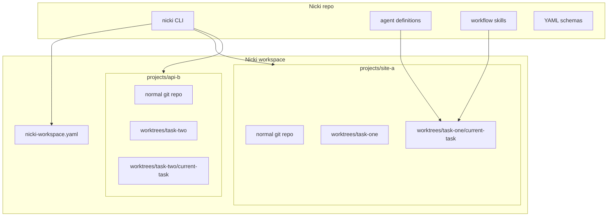

# Nicki — standalone workspace project plan

**Nicki is a good dog.**

This document is the rebuild guide for extracting Nicki from a host repo into its own project. Nicki becomes a repo you clone once; it manages a workspace of other git projects and orchestrates the current-task pipeline inside each project's worktrees.

Use [`NICKI.md`](NICKI.md) for workflow semantics (orchestrator rules, artifact chain, design decisions). Use this file for repo layout, workspace model, and implementation phases.

---

## What changes from today

| Today | Target |
| ----- | ------ |
| Nicki lives inside one app repo (e.g. castlemill-landing) | Nicki is its own repo |
| Workflow files committed in host `.cursor/` | Nicki owns source; installs runtime into managed projects |
| Worktrees under repo root `worktrees/` | Worktrees under each project: `projects/<name>/worktrees/<slug>/` |
| Single-repo scope | Nicki workspace holds many cloned projects in parallel |

Nicki still does **not** implement features. It orchestrates leaf agents, passes artifacts, and calls `/current-task-update` after each step.

---

## Target architecture



### Default filesystem layout

```text
~/NickiWorkspace/                    # created by `nicki workspace init`
├── nicki-workspace.yaml             # registry of managed projects
└── projects/
    ├── castlemill-landing/
    │   ├── .git/
    │   ├── .cursor/                 # runtime installed by Nicki
    │   ├── src/ …                   # normal app repo
    │   ├── worktrees/
    │   │   └── hero-section/
    │   │       ├── current-task/
    │   │       │   ├── current-task-context.yaml
    │   │       │   ├── specs/
    │   │       │   └── …
    │   │       └── … app files …
    │   └── task-archive/            # optional; repo-root archives
    └── some-other-project/
        └── worktrees/
```

### Key design choice: project-local worktrees

Use `[workspace]/projects/<project>/worktrees/<task-slug>`, not a global flat list of worktrees beside all projects.

Why:

- Each project keeps its own git worktree namespace.
- Existing `start-worktrees.sh` logic stays mostly the same — only the repo root path changes.
- Cursor opens a task worktree as a normal workspace; `.cursor/` must exist there (installed from Nicki runtime).
- `current-task/` stays inside the active worktree, matching the model in `NICKI.md`.

---

## This folder layout (staging bundle)

Everything Nicki-related is bundled here so you can move it into a new repo as-is:

```text
nicki/
├── PLAN.md                          # this file
├── NICKI.md                         # workflow semantics + design decisions
├── nicki-workspace.example.yaml     # workspace registry stub
└── runtime/
    └── .cursor/
        ├── agents/                  # subagent definitions (incl. nicki.md)
        ├── commands/                # slash commands
        └── skills/                  # skills + format schemas + start-worktrees.sh
```

When you create the Nicki repo, suggested target:

```text
nicki/                               # new git repo root
├── README.md
├── PLAN.md
├── NICKI.md
├── nicki-workspace.example.yaml
├── bin/nicki                        # CLI (later)
└── package/
    └── .cursor/                     # ← move contents of runtime/.cursor/ here
```

To install runtime into a managed project:

```text
cp -r package/.cursor/*  <workspace>/projects/<project>/.cursor/
```

Or symlink if your OS/setup supports it. Worktrees inherit `.cursor/` from the branch they were created from, so commit runtime to the project's default branch or run a post-create hook.

---

## Repo responsibilities

### Nicki repo owns

- Agent, command, skill, and schema source files (see `runtime/.cursor/`)
- Workspace registry format (`nicki-workspace.yaml`)
- CLI: workspace init, project clone/register, runtime install/update, task start, doctor
- Portable docs: `NICKI.md`, `PLAN.md`

### Each managed project owns

- App source and git history
- Local `.cursor/` runtime (installed/updated by Nicki)
- Its own `worktrees/` directory
- Task archives (`task-archive/` at project root, unless centralized later)
- Optional project-local extensions (e.g. extra skills under `.cursor/skills-local/` — never overwritten by Nicki update)

### Nicki does not own

- Application code
- Host-specific skills (e.g. caveman mode — kept in host repos, not in this bundle)

---

## Workspace registry

`nicki-workspace.yaml` lives at the workspace root. See [`nicki-workspace.example.yaml`](nicki-workspace.example.yaml).

It should track:

- Workspace path
- Managed projects: name, clone URL, local path under `projects/`
- Per-project git defaults: `default_branch`, `remote`
- Per-project setup hooks run after clone or new worktree (e.g. `npm install`)
- Installed Nicki runtime version (for `nicki update-runtime`)

---

## CLI commands (build later)

| Command | Purpose |
| ------- | ------- |
| `nicki workspace init <path>` | Create workspace skeleton + default registry |
| `nicki project clone <url> [name]` | Clone into `projects/<name>` |
| `nicki project register <path> [name]` | Register an existing local repo |
| `nicki runtime install <project>` | Copy/link `package/.cursor/` into project |
| `nicki runtime update <project>` | Refresh managed runtime files |
| `nicki task start <project> <description>` | Pull base branch, create worktree under `worktrees/<slug>` |
| `nicki doctor` | Check registry, git, runtime files, gitignore for worktrees |

Start with bash; add schema validation later if needed.

---

## Adaptations needed before multi-project works

These are the load-bearing changes when you implement — not required to move this folder.

### 1. Generalize `start-worktrees.sh`

Current script assumes repo root = cwd and hardcodes `main`, `origin`, `worktrees/$slug`.

Change to:

- Accept `--project <path>` (default: cwd)
- Read `default_branch` and `remote` from project config or `nicki-workspace.yaml`
- Still create worktrees at `<project>/worktrees/<slug>`

### 2. Update Nicki + leaf agent prompts

Today paths assume a single repo root. After extraction:

- Resolve **project** from workspace registry or user prompt
- Resolve **worktree** as `<project>/worktrees/<slug>`
- Pass absolute paths to leaf agents
- Nicki validates `scope.worktree_path` in context against the selected worktree

Keep invariants from `NICKI.md`:

- Nicki is read-only; only `/current-task-update` writes context YAML
- Leaf agents have `task: false`
- Git side effects need explicit user confirmation
- No `/current-task-update` after `/close-task`

### 3. Gitignore per managed project

Each project should ignore:

```gitignore
worktrees/
task-archive/    # if archives stay local-only
```

Nicki `doctor` can verify this.

### 4. Cursor workspace behavior

When Cursor opens `projects/foo/worktrees/bar`, the workspace root is the worktree. Agents reference `.cursor/skills/...` relative to that root. Ensure runtime is present on the branch used to create worktrees.

---

## Canonical workflow (unchanged)

```
start → describe → spec → subtasks → execute → review → triage → [fix loop] → commit → push → merge → close
```

With automatic `/current-task-update` after each leaf step except close.

Full detail: [`NICKI.md`](NICKI.md).

---

## Implementation phases

1. **Create Nicki repo** — move this `nicki/` folder into a new repo; rename `runtime/.cursor/` → `package/.cursor/`.
2. **Define registry** — finalize `nicki-workspace.yaml` schema; add example.
3. **Minimal CLI** — `workspace init`, `project clone`, `runtime install`, `doctor`.
4. **Adapt worktrees** — project-path-aware `start-worktrees.sh`.
5. **Update prompts** — project/worktree resolution in nicki.md and leaf agents.
6. **Dogfood** — register castlemill-landing as first managed project; run one task end-to-end.

---

## Important invariants

- Nicki repo is the source of truth for workflow runtime files.
- Projects are normal git repos; they work without Nicki except for workflow commands.
- Worktrees belong under their project, not mixed globally.
- `current-task/` stays inside the active task worktree.
- Nicki manages many projects but orchestrates one selected project/task at a time.
- Leaf agents remain leaf agents; Nicki is the only orchestrator.

---

## File map (bundled runtime)

### Orchestrator

| File | Role |
| ---- | ---- |
| `runtime/.cursor/agents/nicki.md` | Nicki subagent definition |
| `NICKI.md` | Workflow semantics |

### State

| File | Role |
| ---- | ---- |
| `runtime/.cursor/agents/current-task-update.md` | State writer |
| `runtime/.cursor/commands/current-task-update.md` | `/current-task-update` |
| `runtime/.cursor/skills/current-task-update/` | Skill + context schema |

### Leaf pipeline

| Step | Agent | Command | Skill |
| ---- | ----- | ------- | ----- |
| Start | `start-task.md` | `start-task.md` | `start-task/` |
| Spec | `spec-maker.md` | `spec-maker.md` | `spec-maker/` |
| Subtasks | `subtask-maker.md` | `subtask-maker.md` | `subtask-maker/` |
| Execute | `execute-plan.md` | `execute-plan.md` | `execute-plan/` |
| Review | `review-execution.md` | `review-execution.md` | `review-execution/` |
| Triage | `review-triage.md` | `review-triage.md` | `review-triage/` |
| Commit | `commit-task.md` | `commit-task.md` | `commit-task/` |
| Push | `push-task.md` | `push-task.md` | `push-task/` |
| Merge | `merge-task.md` | `merge-task.md` | `merge-task/` |
| Close | `close-task.md` | `close-task.md` | `close-task/` |

### Shared

| File | Role |
| ---- | ---- |
| `runtime/.cursor/skills/conflict-resolution/` | Push/merge conflict protocol |
| `runtime/.cursor/skills/next-step-spec/` | Follow-up spec format |
| `runtime/.cursor/skills/start-task/scripts/start-worktrees.sh` | Worktree creation |
