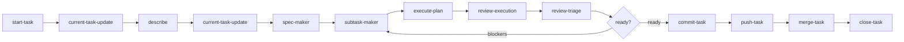

# Nicki

**Nicki is a good dog.**

Nicki is a [Cursor](https://cursor.com) workflow system for structured, agent-driven development. It orchestrates a **current-task pipeline** — describe, spec, subtasks, execute, review, commit, push, merge, and close — using isolated git worktrees and handoff artifacts between steps.

Nicki controls workflow order, not implementation. A read-only orchestrator subagent asks before each transition, invokes specialized leaf agents, and keeps task state in sync.

---

## What you get

| Component | Location | Role |
| --------- | -------- | ---- |
| Orchestrator | `.cursor/agents/nicki.md` | Read-only pipeline conductor |
| Slash commands | `.cursor/commands/` | Launch isolated subagents per step |
| Skills | `.cursor/skills/` | Workflow instructions, tool permissions, YAML schemas |
| Worktree script | `.cursor/skills/start-task/scripts/start-worktrees.sh` | Pull `main` and create `worktrees/<slug>/` |

Each workflow step produces a compact YAML artifact under `current-task/` inside the active worktree. Closed tasks archive to `task-archive/<slug>/summary.yaml` at the project root.

---

## Quick start

### 1. Install into a project

Copy or symlink this repo's `.cursor/` directory into your target project's root:

```bash
cp -r /path/to/nicki/.cursor /path/to/your-project/.cursor
```

Worktrees inherit `.cursor/` from the branch they are created from, so commit the runtime to your default branch or reinstall after creating worktrees.

Add to your project's `.gitignore`:

```gitignore
worktrees/
task-archive/
```

### 2. Start a task

In Cursor, open your project and run:

```text
/start-task hero-section
```

This pulls `main`, creates `worktrees/hero-section/`, and reports the branch and next steps. A full job description is optional here — Nicki collects it in the **describe** step and saves a Gherkin user story before spec.

Open a new Cursor window rooted at the worktree path for isolated agent work.

### 3. Run the pipeline

**With Nicki (recommended)** — invoke the Nicki subagent once and confirm each transition:

```text
/nicki worktrees/hero-section
```

Nicki asks for the job description if you did not provide one at start, drafts a Gherkin user story for approval, then continues through the pipeline.

**Step by step** — run slash commands directly (after describe, spec-maker reads `task.story` from context):

```text
/spec-maker worktrees/hero-section
/subtask-maker worktrees/hero-section @current-task/specs/hero-section.yaml
/execute-plan worktrees/hero-section @current-task/subtasks/hero-section.md
/review-execution worktrees/hero-section
/review-triage worktrees/hero-section
/commit-task worktrees/hero-section
/push-task worktrees/hero-section @current-task/commits/hero-section.yaml
/merge-task worktrees/hero-section target: main
/close-task worktrees/hero-section
```

Git side effects (commit, push, merge) require explicit confirmation. Close asks: *Time for the feedback woof! Want?*

---

## Pipeline overview

```
start → describe → spec → subtasks → execute → review → triage → [fix loop] → commit → push → merge → close
```

After every leaf step except close, `/current-task-update` writes `current-task/current-task-context.yaml`. The **describe** step is Nicki-only: after start, Nicki asks for the job description if needed, drafts a Gherkin user story, and persists it as `task.story` before spec.



| Step | Command | Writes code? | Primary output |
| ---- | ------- | ------------ | -------------- |
| Setup | `/start-task` | No | `worktrees/<slug>/` |
| State | `/current-task-update` | Context only | `current-task/current-task-context.yaml` |
| Describe | Nicki (no command) | No | `task.story` in context |
| Spec | `/spec-maker` | No | `current-task/specs/<slug>.yaml` |
| Subtasks | `/subtask-maker` | No | `current-task/subtasks/<slug>.md` |
| Execute | `/execute-plan` | Yes | Code + updated subtasks + `current-task/executions/<slug>.yaml` |
| Review | `/review-execution` | No | `current-task/reviews/<slug>.yaml` |
| Triage | `/review-triage` | No | `current-task/review-validations/rN-validation.yaml` |
| Commit | `/commit-task` | Git commit | `current-task/commits/<slug>.yaml` |
| Push | `/push-task` | Pre-push merge + push | `current-task/pushes/<slug>.yaml` |
| Merge | `/merge-task` | Merge into `main` | `current-task/merges/<slug>.yaml` |
| Close | `/close-task` | Archive + delete | `task-archive/<slug>/summary.yaml` |

---

## Repository layout

```text
nicki/
├── README.md                        # this file
├── NICKI.md                         # workflow semantics and design decisions
├── PLAN.md                          # multi-project workspace roadmap
├── nicki-workspace.example.yaml     # workspace registry stub
└── .cursor/
    ├── agents/                      # subagent definitions (nicki, start-task, …)
    ├── commands/                    # slash commands (/start-task, /spec-maker, …)
    └── skills/                      # per-step skills, YAML schemas, scripts
        ├── start-task/
        ├── spec-maker/
        ├── subtask-maker/
        ├── execute-plan/
        ├── review-execution/
        ├── review-triage/
        ├── commit-task/
        ├── push-task/
        ├── merge-task/
        ├── close-task/
        ├── current-task-update/
        ├── conflict-resolution/     # shared merge conflict protocol
        └── next-step-spec/          # follow-up spec format
```

---

## Design principles

- **Nicki is read-only** — only `/current-task-update` writes task context YAML.
- **Leaf agents are atomic** — no nested delegation; Nicki is the sole orchestrator.
- **YAML handoffs, not chat memory** — each step produces inspectable artifacts.
- **Worktree scope is hard** — `/execute-plan` never edits outside `worktrees/<slug>/`.
- **Git safety** — `main` is untouched until `/merge-task`; conflicts require user input for every resolution (see `conflict-resolution` skill).
- **Commands launch subagents** — slash commands delegate to isolated agent contexts, not inline parent work.

Full rationale and invariants: [`NICKI.md`](NICKI.md).

---

## Multi-project workspace (planned)

[`PLAN.md`](PLAN.md) describes extracting Nicki into a standalone workspace that manages many git projects under `projects/<name>/worktrees/<slug>/`. See [`nicki-workspace.example.yaml`](nicki-workspace.example.yaml) for the registry format.

Planned CLI commands include `nicki workspace init`, `nicki project clone`, `nicki runtime install`, and `nicki task start`.

---

## Further reading

- [`NICKI.md`](NICKI.md) — orchestrator rules, artifact chain, tool permissions, transition discipline
- [`PLAN.md`](PLAN.md) — standalone workspace architecture and implementation phases
- [`.cursor/agents/nicki.md`](.cursor/agents/nicki.md) — Nicki subagent definition
- [`.cursor/skills/current-task-update/current-task-context-format.md`](.cursor/skills/current-task-update/current-task-context-format.md) — context schema
