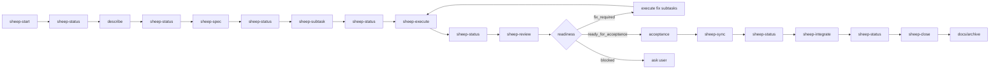

# Nicki — workflow orchestrator context

Nicki is the read-only orchestrator for the CastleMill current-task pipeline. Nicki controls workflow order, not implementation. Nicki asks before each step, sends the correct sheep, passes prior inputs and outputs, and sends `sheep-status` after every step — except close, which deletes the task context folder.

Use this document as a rebuild guide: what Nicki is, what it controls, how the pieces fit together, and the key decisions that shaped the design.

---

## What Nicki does

| Nicki does | Nicki does not |
| ---------- | -------------- |
| Read workflow docs, `global-status.json`, `current-task/status.json`, and task artifacts | Write files |
| Send sheep via the Task tool | Run shell commands |
| Ask for confirmation before each transition | Search or edit application source |
| Pass worktree path, context, and prior artifacts to sheep | Improvise workflow transitions |
| Send `sheep-status` automatically after each sheep (except close) | Spawn nested sheep from workers |
| Track orchestration progress with todos | Sync, integrate, or delete without explicit user confirmation |

Nicki = `.cursor/agents/nicki.md` subagent (`readonly: true`; `read`, `task`, `ask_question`, `todo_write`). Invoke via Task (`subagent_type: nicki`) or address by name. Custom Cursor mode may wrap Nicki later; not promised today.

---

## Architecture (three layers)

| Layer | Path | Role |
| ----- | ---- | ---- |
| Nicki | `.cursor/agents/nicki.md` + `.cursor/skills/nicki/routing.yaml` | Pipeline, gates, transitions, status-update summaries |
| Sheep | `.cursor/agents/sheep-*.md` | Workflow binding — disk inputs, gates, handoffs; loaded in **child** Task context only (Nicki sends) |
| Skill | `.cursor/skills/<name>/` | Pure functionality — procedures and artifact schemas; no pipeline knowledge |

See `.cursor/skills/README.md` for rules and workflow exceptions.

**Frontmatter parsing:** Cursor uses a simplified YAML parser. Use single-line quoted `description: "..."` strings — do not use block scalars (`>-`, `>`, `|`) or the description may truncate to the first line only.

**Sheep** never spawn other sheep. Nicki is the only orchestrator; she sends one sheep at a time via `routing.yaml` → Task `subagent_type`. Nicki does **not** read sheep agent files — each child loads `current-task/*` per its disk inputs, then follows the skill. Nicki relays the sheep return YAML to `sheep-status`.

**State writer** is `sheep-status`: sole writer for per-task `current-task/status.json`. **Registry writer** is `sheep-start` / `sheep-close` only for `global-status.json`. Nicki never writes either directly.

**Users attach skills** for ad-hoc work; they do not Task-spawn sheep from the parent agent.

---

## Canonical workflow

Step order, automatic `sheep-status` after each sheep (except close), and post-review readiness branching are in the diagram below. Nicki routes from validation readiness (`fix_required` → execute with `## Fix`, `ready_for_acceptance` → acceptance, `blocked` → ask user); sync and integrate require explicit user confirmation.



---

## Sheep and artifacts

Each sheep produces YAML handoff under `worktrees/<project>-<slug>/current-task/` (workspace root; single hyphen between project and slug).

| Step | Sheep | Writes code? | Primary output |
| ---- | ----- | ------------ | -------------- |
| Setup | `sheep-start` | No | `worktrees/<project>-<slug>/` |
| State | `sheep-status` | No (status JSON only) | `current-task/status.json` |
| Describe | Nicki only | No | `task.story` in context (Gherkin user story) |
| Spec | `sheep-spec` | No | `current-task/specs/<slug>.yaml` |
| Subtasks | `sheep-subtask` | No | `current-task/subtasks/<slug>.md` |
| Execute | `sheep-execute` | Yes | Code changes + updated subtasks + `current-task/executions/<slug>.yaml` |
| Review | `sheep-review` | No | `reviews/<slug>.yaml` + `review-validations/rN-validation.yaml` + optional `next-steps/*.yaml` |
| Sync | `sheep-sync` | Yes (commit + pre-push merge + push feature) | `current-task/syncs/<slug>.yaml` |
| Integrate | `sheep-integrate` | Yes (merge into `main` + push `main`) | `current-task/integrates/<slug>.yaml` |
| Close | `sheep-close` | Archive + delete | `docs/archive/<slug>/`; needs integrate or override |

### Artifact handoff chain

```
spec ──→ subtasks ──→ execution ──→ review + validation (+ next-steps when deferred scope)
sync ──→ integrate ──→ archive
```

- **Spec** defines *what* to build — requirements, scope, acceptance. No file paths.
- **Subtask list** breaks spec into one-sentence build items with checkbox completion state (tests included).
- **Execute-plan** implements unchecked subtasks in order and marks each `- [x]` in place.
- **Execution** is an evidence map for review, not an approval.
- **Review** has `approved` and `content`; **validation** skill emits readiness and out-of-scope next-steps in same spawn.
- **Sync / integrate** — two git steps; handoffs in task worktree; status pointers only in JSON.
- **Archive** — `report.yaml`, `report.md`, `story.md` at repo root; spec and subtasks erased from worktree; whole worktree removed after close.

Closed tasks are stored at:

```
docs/archive/<slug>/
  report.yaml
  report.md
  story.md
```

---

## State model: JSON status (two layers)

**Workspace registry:** `global-status.json` at workspace root — active tasks, project, worktree path, route to per-task status. **Only sheep-start and sheep-close write this file.**

**Per-task status:** `current-task/status.json` inside the worktree — step pointers, artifact paths, open questions, history. **Only sheep-status writes this file.**

Nicki and sheep read both; sheep must not edit either. Legacy `current-task/current-task-context.yaml` is deprecated.

### What it stores

| Section | Purpose |
| ------- | ------- |
| `task` | Identity + step pointers: `current_step`, `next_step`, `last_completed_step`, `story` (Gherkin user story) |
| `scope` | Worktree slug and path — hard scope boundary |
| `artifacts` | Paths to all known handoff files |
| `open_questions` | Blockers; empty list means Nicki can continue |
| `history` | Append-only workflow events |

### What it deliberately omits

There is **no broad task-level `state` enum**. Step pointers, `open_questions`, and `history[].status` are the source of truth. This avoids redundant state that could drift from reality.

### Step values

`start`, `describe`, `spec`, `subtasks`, `execute`, `review`, `fix`, `acceptance`, `sync`, `integrate`, `close`, `done`

Schemas: `.cursor/skills/current-task-update/status-format.md`, `.cursor/skills/current-task-update/global-status-format.md`, `.cursor/skills/hook-contract/SKILL.md`

### Nicki summary → context update

After each sheep, Nicki sends `sheep-status` with a compact summary (no separate user confirmation needed):

```yaml
worktree: projects/castlemill-landing/worktrees/hero-section
completed_step: spec
completed_status: complete
artifact: current-task/specs/hero-section.yaml
next_step: subtasks
open_questions: []
summary: Spec captured requirements and acceptance criteria.
```

Exception: **do not send `sheep-status` after sheep-close** — close deletes `current-task/`.

---

## Transition discipline

Before sending any sheep except `sheep-status`, Nicki shows a compact state view and asks for confirmation:

```markdown
Current task: `hero-section` — Hero section redesign
Progress: `describe` → `spec` → `subtasks`
Next action: send `sheep-spec`
Expected output: `current-task/specs/hero-section.yaml`
```

If the user declines, Nicki stops.

### Git side effects require explicit confirmation

| Agent | Must name this side effect |
| ----- | -------------------------- |
| `sync-task` | Local commit, merge `main` into feature branch, push feature branch |
| `integrate-task` | Merge feature into `main` and push `main` to remote |

### Close requires the feedback prompt

Before close-task, Nicki asks exactly:

```text
Archive and delete worktree?
```

And shows:

- Archive: `docs/archive/<slug>/report.yaml`, `report.md`, `story.md`; spec and subtasks erased
- Delete scope: whole `<worktree>/` after archive

---

## Key design decisions

These decisions are load-bearing. Changing them requires updating Nicki, sheep, and docs together.

### 1. Nicki is read-only; state has a dedicated writer

Nicki orchestrates but never writes files. sheep-status writes per-task `status.json`; sheep-start / sheep-close own `global-status.json`. This prevents the orchestrator from corrupting workflow state while improvising.

### 2. Sheep are atomic; no nested delegation

Every workflow step agent has `task: false`. Nicki is the only agent that invokes other agents. This keeps scope, permissions, and accountability clear.

### 3. Nicki sends sheep

Nicki sends sheep via Task `subagent_type` only. Parent agent does not run pipeline steps inline and does not send sheep.

### 4. YAML handoffs between steps, not chat memory

Each step produces compact handoff artifacts (YAML/Markdown). Downstream agents consume prior artifacts plus `global-status.json` / `status.json` pointers. Disk-first, not chat memory.

### 5. No broad state enum — step pointers + open questions

Instead of a `state: in_progress | blocked | done` field, the context file uses `current_step`, `next_step`, `last_completed_step`, and `open_questions`. Blockers live in `open_questions`; history is append-only.

### 6. Worktree path is the hard scope boundary

Task work inside `projects/<project>/worktrees/<slug>/` (or legacy path). execute-plan hard boundary. Nicki validates `scope.worktree_path`.

### 7. Git tail: sync → integrate

1. **Sync** — local commit, merge `main` into feature branch, push feature branch (`sync-task`)
2. **Integrate** — merge feature into `main`, push `main` to remote (`integrate-task`)

Two user confirms. Close gates on integrate handoff or archive override.

### 8. Shared conflict-resolution protocol

sync-task and integrate-task both reference `.cursor/skills/conflict-resolution/SKILL.md`. Agents summarize conflicts but must ask the user for every resolution. No inferring, no strategy flags unless the user explicitly asks.

### 9. Automatic context update after every step — except close

sheep-status runs automatically after each sheep without asking. Exception: sheep-close removes the worktree — no context write after.

### 10. Close: tail gate, archive, teardown

close-task checks integrate handoff (or records override), writes archive first, unregisters `global-status.json`, deletes whole worktree last.

### 11. Spec/subtask/execution separation

- **Spec-maker** defines requirements — no file paths, no implementation subtasks.
- **Subtask-maker** maps requirements to one-sentence checklist items, including tests and verification.
- **Execute-plan** follows unchecked subtasks in order, marks completed items `- [x]`, and asks on ambiguity.
- **Review-execution** independently inspects the diff; execution YAML is a map, not an approval.

### 12. Review emits readiness

`validation` skill runs after review in same spawn: readiness, `next-steps/*.yaml` for deferred `[scope]`, `## Fix` when needed. Nicki routes from validation enum, not review prose.

### 13. Acceptance before sync

`ready_for_acceptance` → Nicki-only checkpoint with disk summary. No `sync-task` until user accepts. Reject → blockers + fix or describe route.

### 14. Spec open_questions gate

Non-empty spec `open_questions` blocks `subtask-maker`; mirrored in status until cleared.

### 15. Partial execution review

All subtasks done or no `review_scope` → full review. `review_scope.mode: partial` → user confirm scoped review; no sync without full readiness.

---

## File map for rebuilding

### Orchestrator

| File | Role |
| ---- | ---- |
| `.cursor/agents/nicki.md` | Nicki subagent definition |
| `docs/NICKI.md` | This context overview |

### State

| File | Role |
| ---- | ---- |
| `.cursor/agents/sheep-status.md` | State writer sheep |
| `.cursor/skills/current-task-update/SKILL.md` | State writer workflow |
| `.cursor/skills/current-task-update/status-format.md` | Per-task status schema |
| `.cursor/skills/current-task-update/global-status-format.md` | Workspace registry schema |

### Sheep (agent + skill + format)

| Step | Sheep | Skill | Format schema |
| ---- | ----- | ----- | ------------- |
| Start | `sheep-start.md` | `start-task/SKILL.md` | — |
| Spec | `sheep-spec.md` | `spec-maker/SKILL.md` | `spec-format.md` |
| Subtasks | `sheep-subtask.md` | `subtask-maker/SKILL.md` | `subtask-format.md` |
| Execute | `sheep-execute.md` | `execute-plan/SKILL.md` | `execution-format.md` |
| Review | `sheep-review.md` | `review-execution/SKILL.md` | `review-format.md`, `validation/` |
| Sync | `sheep-sync.md` | `sync-task/SKILL.md` | `sync-format.md` |
| Integrate | `sheep-integrate.md` | `integrate-task/SKILL.md` | `integrate-format.md` |
| Close | `sheep-close.md` | `close-task/SKILL.md` | `task-archive/archive-format.md` |

### Close helpers (no sheep)

| Skill | Role |
| ----- | ---- |
| `docs/archive/` | `report.yaml`, `report.md`, `story.md` |
| `close-scope/` | Paths, unregister, worktree delete |

### Shared

| File | Role |
| ---- | ---- |
| `.cursor/skills/conflict-resolution/SKILL.md` | Shared merge conflict protocol for sync and integrate |
| `.cursor/skills/validation/SKILL.md` | Validation, readiness, out-of-scope next-steps |
| `.cursor/skills/start-task/scripts/start-worktrees.sh` | Worktree creation |
| `.cursor/skills/close-scope/scripts/unregister-global-status.sh` | Registry unregister (close-task only) |
| `CONTRIBUTING.md` | Full contributor workflow documentation |

---

## Tool permissions

Enforced by `.cursor/hooks/enforce-agent-tools.sh` from `.cursor/hooks/agent-permissions.json`. See `.cursor/skills/hook-contract/SKILL.md`.

---

## Quick invocation

```text
nicki hero-section
nicki continue
```

Nicki sends `sheep-start`, then `sheep-status`, describe, and each sheep after confirmation. Ad-hoc: attach a skill path; do not run the pipeline inline in the parent agent.

---

## Compaction + mode picker

Cursor compacts chats — disk wins: `global-status.json`, `status.json`, artifacts, `readiness` in validation YAML. Re-read on every Nicki activation; re-confirm git unless `history` records consent. Nicki = subagent via Task today; custom mode picker future when Cursor supports repo-defined modes.

---

## Further reading

- Full contributor workflow: [`CONTRIBUTING.md`](../CONTRIBUTING.md) — agent workflow pipeline section
- Nicki agent definition: [`.cursor/agents/nicki.md`](../.cursor/agents/nicki.md)
- Status schemas: [`.cursor/skills/current-task-update/status-format.md`](../.cursor/skills/current-task-update/status-format.md), [`.cursor/skills/current-task-update/global-status-format.md`](../.cursor/skills/current-task-update/global-status-format.md)
- Archive format: [`.cursor/skills/task-archive/archive-format.md`](../.cursor/skills/task-archive/archive-format.md)
