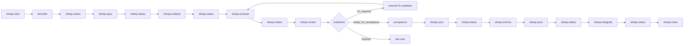

# Nicki — workflow orchestrator context

Nicki is the orchestrator for the CastleMill current-task pipeline. Nicki controls workflow order, not implementation. Nicki runs bootstrap for position, asks yes only before execute and sync, sends the correct sheep, and sends `sheep-status` after every step — except start, whose script already wrote the position, and close, which deletes the task context folder.

Use this document as a rebuild guide: what Nicki is, what it controls, how the pieces fit together, and the key decisions that shaped the design.

---

## What Nicki does

| Nicki does | Nicki does not |
| ---------- | -------------- |
| Run `bootstrap-context.py` (shell allowlist) | Write files or run other shell |
| Send sheep via the Task tool | Search or edit application source |
| Ask for confirmation before **execute** and **sync** | Improvise workflow transitions |
| Pass worktree path, context, and prior artifacts to sheep | Spawn nested sheep from workers |
| Send `sheep-status` automatically after each sheep (except start and close) | Skip execute/sync without explicit user confirmation |
| Track orchestration progress with todos | Re-derive sheep map from prose (scripts + `routing.json` own that) |

Nicki = `.cursor/agents/nicki.md` subagent (`readonly: true`; shell only for bootstrap; `read`, `task`, `ask_question`, `todo_write`). Invoke via Task (`subagent_type: nicki`) or address by name. Custom Cursor mode may wrap Nicki later; not promised today.

### Harness scripts

Authoritative read / write surface (spawn gate retired 2026-08-05 — see [retire-check-gate design](superpowers/specs/2026-08-05-retire-check-gate-design.md)):

| Type | Script | Role |
| ---- | ------ | ---- |
| Read | `bootstrap-context.py` | Position (`current_step`, `next_step`), intended sheep on stdout |
| Write | `update-status.py` | `sheep-status` path — Nicki passes `--step`/`--mode`; routing owns `next_step` on normal completion |

### Bootstrap chain

**Session** cold start (hooks / parent) may surface registry pointers. **Disk** bootstrap is Nicki’s every-response read: resolve worktree → run `bootstrap-context.py` → card and route from stdout only. Consent for execute/sync is chat only. Do not re-read `status.json` for routing while bootstrap succeeds.

---

## Architecture (three layers)

| Layer | Path | Role |
| ----- | ---- | ---- |
| Nicki | `.cursor/agents/nicki.md` + `.cursor/skills/nicki/routing.json` | Pipeline, gates, transitions, status-update summaries |
| Sheep | `.cursor/agents/sheep-*.md` | Workflow binding — disk inputs, gates, handoffs; loaded in **child** Task context only (Nicki sends) |
| Skill | `.cursor/skills/<name>/` | Pure functionality — procedures and artifact schemas; no pipeline knowledge |

See `.cursor/skills/README.md` for rules and workflow exceptions.

**Frontmatter parsing:** Cursor uses a simplified YAML parser. Use single-line quoted `description: "..."` strings — do not use block scalars (`>-`, `>`, `|`) or the description may truncate to the first line only.

**Sheep** never spawn other sheep. Nicki is the only orchestrator; she sends one sheep at a time via `routing.json` → Task `subagent_type`. Nicki does **not** read sheep agent files — each child loads `current-task/*` per its disk inputs, then follows the skill. Nicki relays the sheep return JSON to `sheep-status`.

**State writer** is `sheep-status`: sole writer for per-task `current-task/status.json`. **Registry writer** is `sheep-start` / `sheep-close` only for `global-status.json`. Nicki never writes either directly.

**Ad-hoc work** spawns a sheep directly from the parent agent (or attaches the skill) — no task, no status write. `sheep-start`, `sheep-close`, and `sheep-status` stay Nicki-only.

---

## Canonical workflow

Step order and automatic `sheep-status` after each sheep (except start and close) are in the diagram below. Step→sheep mapping lives in `routing.json` + `bootstrap-context.py` — not duplicated here. Explicit chat confirmation is required before **execute** and **sync** only.


```mermaid
flowchart LR
  A[sheep-start] --> C[describe]
  C --> D[sheep-status]
  D --> E[sheep-spec]
  E --> F[sheep-status]
  F --> G[sheep-subtask]
  G --> H[sheep-status]
  H --> I[sheep-execute]
  I --> J[sheep-status]
  J --> K[sheep-review]
  K --> L{readiness}
  L -->|fix_required| P[execute fix subtasks]
  P --> I
  L -->|ready_for_acceptance| Acp[acceptance]
  Acp --> Q[sheep-sync]
  L -->|blocked| Ask[ask user]
  Q --> R[sheep-status]
  R --> Arch[sheep-archive]
  Arch --> Q2[sheep-sync]
  Q2 --> R2[sheep-status]
  R2 --> S[sheep-integrate]
  S --> T[sheep-status]
  T --> Y[sheep-close]
```

---

## Sheep and artifacts

Each sheep produces YAML handoff under `worktrees/<project>-<slug>/current-task/` (workspace root; single hyphen between project and slug).

| Step | Sheep | Writes code? | Primary output |
| ---- | ----- | ------------ | -------------- |
| Setup | `sheep-start` | No | `worktrees/<project>-<slug>/` |
| State | `sheep-status` | No (status JSON only) | `current-task/status.json` |
| Describe | Nicki only | No | `artifacts.story` → `current-task/story.md` (Gherkin user story) |
| Spec | `sheep-spec` | No | `current-task/specs/<slug>.json` |
| Subtasks | `sheep-subtask` | No | `current-task/subtasks/<slug>.md` |
| Execute | `sheep-execute` | Yes | Code changes + updated subtasks (no execution JSON) |
| Review | `sheep-review` | No | No file — verdict in the return `summary` |
| Sync | `sheep-sync` | Yes (commit + pre-push merge + push feature) | Git side effects only |
| Archive | `sheep-archive` | No (writes `docs/archive/`) | `docs/archive/<slug>/report.json` |
| Integrate | `sheep-integrate` | Yes (merge into `main` + push `main`) | Git side effects only |
| Close | `sheep-close` | Delete worktree | unregister + teardown |

### Artifact handoff chain

```
spec ──→ subtasks ──→ execute (code + checklist) ──→ review (verdict in the return summary)
sync ──→ archive ──→ sync ──→ integrate ──→ close
```

- **Spec** defines *what* to build — requirements, scope, acceptance. No file paths.
- **Subtask list** breaks spec into one-sentence build items with checkbox completion state (tests included).
- **Execute-plan** implements unchecked subtasks in order and marks each `- [x]` in place. No `executions/*.json` handoff.
- **Review** inspects the worktree diff plus available `current-task/` files and reports its verdict in the return `summary`. No review file, no readiness file — Nicki turns the verdict into `next_step`.
- **Archive** — `report.yaml`, `report.md`, `story.md` under `docs/archive/`; committed on feature branch before integrate. `current-task/` is gitignored (worktree-local).
- **Close** — unregister + delete whole worktree after integrate.

Closed tasks are stored at:

```
docs/archive/<slug>/
  report.yaml
  report.md
  story.md
```

---

## State model: JSON status (two layers)

**Workspace registry:** `global-status.json` at workspace root — active tasks, project, worktree path, route to per-task status. **Only sheep-start and sheep-close write this file.**

**Per-task status:** `current-task/status.json` inside the worktree — `task-status.v2`: step pointers (`current_step`, `next_step`), artifact paths, `open_questions`. **Only sheep-status writes this file.**

Nicki and sheep read both; sheep must not edit either. Legacy `current-task/current-task-context.json` is deprecated.

### What it stores

| Section | Purpose |
| ------- | ------- |
| `meta` | Schema identifier only (`task-status.v2`) |
| `task` | Identity + step pointers: `current_step`, `next_step`, optional `side_effects`, short `original` |
| `scope` | `worktree_path` — hard scope boundary |
| `artifacts` | Paths to document files (`story`, `spec`, `subtasks`, `archive`) |
| `open_questions` | Blockers; empty list means Nicki can continue |

### What it deliberately omits

No verbose `history[]`, no `completed_steps`, no `last_completed_step`, no duplicate pointers (`story_artifact`, `artifacts.status`, `scope.worktree`), no ceremony meta (`generated_by`, `updated_by`, `version`). There is **no broad task-level `state` enum** — step pointers, artifact pointers, and `open_questions` are the source of truth. Out-of-band runs are logged in `task.side_effects`, not by moving position.

### Step values

`start`, `describe`, `spec`, `subtasks`, `execute`, `review`, `fix`, `acceptance`, `sync`, `archive`, `integrate`, `close`, `done`

Schemas: `.cursor/skills/current-task-update/status-format.md`, `.cursor/skills/current-task-update/global-status-format.md`, `.cursor/skills/hook-contract/SKILL.md`

### Nicki summary → context update

After each sheep except start and close, Nicki sends `sheep-status` with a compact summary plus the `--step` and `--mode` she dispatched (no separate user confirmation needed). On normal completion, routing owns `next_step` — the summary does not need it.

```yaml
worktree: projects/castlemill-landing/worktrees/hero-section
artifact: current-task/specs/hero-section.json
open_questions: []
summary: Spec captured requirements and acceptance criteria.
```

Nicki passes `--step spec --mode normal` (or `jump` to skip ahead — see [`flexibility.md`](flexibility.md)).

Exceptions: **do not send `sheep-status` after sheep-start** — `create-worktree.py` already wrote the opening position — **or after sheep-close** — close deletes `current-task/`.

---

## Transition discipline

Before each sheep (except `sheep-status`), Nicki shows a compact state card. **Explicit yes is required only for `execute` and `sync`.** Other steps spawn after the card without waiting for approval. Sheep name comes from bootstrap / `routing.json` — there is no spawn-gate script.

`--mode jump` changes how `update-status.py` moves position; `normal` and `jump` are the only modes, and both need a task. Ad-hoc work does not go through Nicki at all — the agent spawns the sheep directly (see [`flexibility.md`](flexibility.md)).

---

## Key design decisions

These decisions are load-bearing. Changing them requires updating Nicki, sheep, and docs together.

### 1. Nicki does not write state; harness owns position

Nicki orchestrates but never writes files. She may run only `bootstrap-context.py`. sheep-status writes per-task `status.json` via `update-status.py`; sheep-start / sheep-close own `global-status.json`. This keeps the orchestrator from corrupting workflow state while improvising.

### 2. Sheep are atomic; no nested delegation

Every workflow step agent has `task: false`. Nicki is the only agent that invokes other agents. This keeps scope, permissions, and accountability clear.

### 3. Nicki sends sheep

Nicki sends sheep via Task `subagent_type` only. Parent agent does not run pipeline steps inline and does not send sheep.

### 4. YAML handoffs between steps, not chat memory

Each step produces compact handoff artifacts (YAML/Markdown). Downstream agents consume prior artifacts plus `global-status.json` / `status.json` pointers. Disk-first, not chat memory.

### 5. No broad state enum — step pointers + open questions

Instead of a `state: in_progress | blocked | done` field, status uses `current_step`, `next_step`, and `open_questions`. Blockers live in `open_questions`; handoff summaries live in artifact files, not status.

### 6. Worktree path is the hard scope boundary

Task work inside `projects/<project>/worktrees/<slug>/` (or legacy path). execute-plan hard boundary. Nicki validates `scope.worktree_path`.

### 7. Git tail: sync → archive → sync → integrate → close

1. **Sync** — local commit, merge `main` into feature branch, push feature branch (`sync-task`)
2. **Archive** — write `docs/archive/<slug>/` (`sheep-archive` / `task-archive`); no git
3. **Sync** (again) — commit and push `docs/archive/`
4. **Integrate** — merge feature into `main`, push `main` to remote (`integrate-task`)
5. **Close** — unregister `global-status.json`, delete worktree (`close-task` / `close-scope`)

`current-task/` is gitignored — orchestration stays worktree-local; only `docs/archive/` and product changes reach `main`.

Three chat confirms that matter for consent: **execute**, then **sync** (acceptance). Archive / integrate / close proceed without a second gate script; conflict/problems still need user approval per the hard-gate note in `nicki.md`.

### 8. Shared conflict-resolution protocol

sync-task and integrate-task both reference `.cursor/skills/conflict-resolution/SKILL.md`. Agents summarize conflicts but must ask the user for every resolution. No inferring, no strategy flags unless the user explicitly asks.

### 9. Automatic context update after every step — except start and close

sheep-status runs automatically after each sheep without asking. Two exceptions: sheep-start's script has already written the opening position, and sheep-close removes the worktree — no context write after either.

### 10. Close: teardown

close-task unregisters `global-status.json` and deletes the whole worktree last. Archive runs earlier via `sheep-archive`. Nothing gates close on a file: routing reaches `close` only from integrate, and the status script refuses to jump there.

### 11. Spec/subtask/execute separation

- **Spec-maker** defines requirements — no file paths, no implementation subtasks.
- **Subtask-maker** maps requirements to one-sentence checklist items, including tests and verification.
- **Execute-plan** follows unchecked subtasks in order, marks completed items `- [x]`, and asks on ambiguity. Omits execution JSON.
- **Review-execution** independently inspects the diff plus available current-task files; no execution handoff required.

### 12. Review outcomes; Nicki sets next_step

Review returns a summary; Nicki may set summary `next_step` to `acceptance`, `execute`, or `review`. Default routing after review is `acceptance`. Validation readiness files are retired.

### 13. Acceptance before sync

After review lands on `acceptance`, Nicki asks yes before `sync`. No spawn-gate script.

### 14. Spec open_questions

Non-empty `open_questions` are relayed in chat and stored in status. Sheep shape them; there is no script spawn veto for open questions.

### 15. Partial review scope

Partial review scope (when supplied via Nicki prompt) is conversation-scoped. Review does not load an execution artifact for scope.

---

## File map for rebuilding

### Orchestrator

| File | Role |
| ---- | ---- |
| `.cursor/agents/nicki.md` | Nicki subagent definition |
| `docs/NICKI.md` | This context overview |

### State

| File | Role |
| ---- | ---- |
| `.cursor/agents/sheep-status.md` | State writer sheep |
| `.cursor/skills/current-task-update/SKILL.md` | State writer workflow |
| `.cursor/skills/current-task-update/status-format.md` | Per-task status schema |
| `.cursor/skills/current-task-update/global-status-format.md` | Workspace registry schema |

### Sheep (agent + skill + format)

| Step | Sheep | Skill | Format schema |
| ---- | ----- | ----- | ------------- |
| Start | `sheep-start.md` | `start-task/SKILL.md` | — |
| Spec | `sheep-spec.md` | `spec-maker/SKILL.md` | `spec-format.md` |
| Subtasks | `sheep-subtask.md` | `subtask-maker/SKILL.md` | `subtask-format.md` |
| Execute | `sheep-execute.md` | `execute-plan/SKILL.md` | — (no execution JSON) |
| Review | `sheep-review.md` | `review-execution/SKILL.md` | `review-format.md`, `validation/` |
| Sync | `sheep-sync.md` | `sync-task/SKILL.md` | (no handoff file) |
| Archive | `sheep-archive.md` | `task-archive/SKILL.md` | `task-archive/archive-format.md` |
| Integrate | `sheep-integrate.md` | `integrate-task/SKILL.md` | (no handoff file) |
| Close | `sheep-close.md` | `close-task/SKILL.md` | — |

### Close helpers (no sheep)

| Skill | Role |
| ----- | ---- |
| `docs/archive/` | `report.yaml`, `report.md`, `story.md` |
| `close-scope/` | Paths, unregister, worktree delete |

### Shared

| File | Role |
| ---- | ---- |
| `.cursor/skills/conflict-resolution/SKILL.md` | Shared merge conflict protocol for sync and integrate |
| `.cursor/skills/validation/SKILL.md` | Validation, readiness, out-of-scope next-steps |
| `.cursor/skills/start-task/scripts/start-worktrees.sh` | Worktree creation |
| `.cursor/skills/close-scope/scripts/unregister-global-status.sh` | Registry unregister (close-task only) |
| `CONTRIBUTING.md` | Full contributor workflow documentation |

---

## Tool permissions

Enforced by `.cursor/hooks/enforce-agent-tools.sh` from `.cursor/hooks/agent-permissions.json`. See `.cursor/skills/hook-contract/SKILL.md`.

---

## Quick invocation

```text
nicki hero-section
nicki continue
```

Nicki sends `sheep-start` (no status write — the script already wrote position), then describe, and each sheep after confirmation with `sheep-status` after every sheep except start and close. Ad-hoc: spawn one sheep directly with instructions and an output path; do not run the pipeline inline in the parent agent.

---

## Compaction + mode picker

Cursor compacts chats — disk wins via harness: `bootstrap-context.py` stdout, then artifacts as needed. Re-bootstrap on every Nicki activation; re-confirm before execute and sync. Nicki = subagent via Task today; custom mode picker future when Cursor supports repo-defined modes.

---

## Further reading

- Full contributor workflow: [`CONTRIBUTING.md`](../CONTRIBUTING.md) — agent workflow pipeline section
- Flexibility (ad-hoc + jump): [`flexibility.md`](flexibility.md)
- Nicki agent definition: [`.cursor/agents/nicki.md`](../.cursor/agents/nicki.md)
- Harness read/write types: [`docs/superpowers/specs/2026-07-17-harness-read-write-types-design.md`](superpowers/specs/2026-07-17-harness-read-write-types-design.md)
- Status schemas: [`.cursor/skills/current-task-update/status-format.md`](../.cursor/skills/current-task-update/status-format.md), [`.cursor/skills/current-task-update/global-status-format.md`](../.cursor/skills/current-task-update/global-status-format.md)
- Archive format: [`.cursor/skills/task-archive/archive-format.md`](../.cursor/skills/task-archive/archive-format.md)
