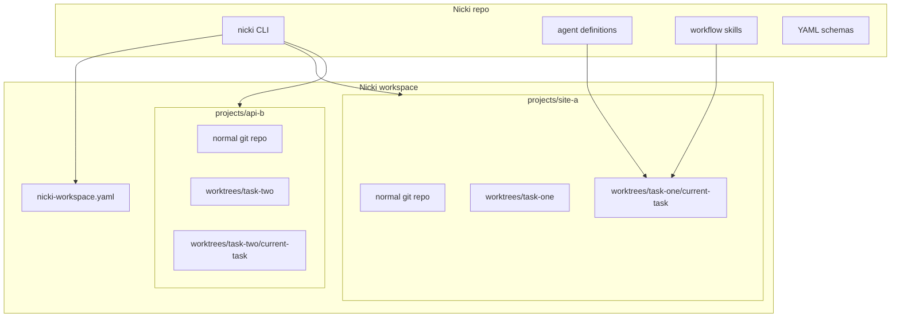

# Nicki — standalone workspace project plan

**Nicki is a good dog.**

This document is the rebuild guide for extracting Nicki from a host repo into its own project. Nicki becomes a repo you clone once; it manages a workspace of other git projects and orchestrates the current-task pipeline inside each project's worktrees.

Use [`NICKI.md`](NICKI.md) for workflow semantics (orchestrator rules, artifact chain, design decisions). Use this file for repo layout, workspace model, and implementation phases.

---

## What changes from today

| Today | Target |
| ----- | ------ |
| Nicki lives inside one app repo (e.g. castlemill-landing) | Nicki is its own repo |
| Workflow files committed in host `.cursor/` | Nicki owns source; installs runtime into managed projects |
| Worktrees under repo root `worktrees/<project>-<slug>/` | Workspace-root `worktrees/<project>-<slug>/` via `create-worktree.py` |
| Single-repo scope | Nicki workspace holds many cloned projects in parallel |

Nicki still does **not** implement features. It orchestrates sheep via Task, passes artifacts, and sends `sheep-status` after each step.

---

## Target architecture



### Default filesystem layout

```text
~/NickiWorkspace/                    # created by `nicki workspace init`
├── nicki-workspace.yaml             # registry of managed projects
└── projects/
    ├── castlemill-landing/
    │   ├── .git/
    │   ├── .cursor/                 # runtime installed by Nicki
    │   ├── src/ …                   # normal app repo
    │   ├── worktrees/
    │   │   └── hero-section/
    │   │       ├── current-task/
    │   │       │   ├── status.json
    │   │       │   ├── specs/
    │   │       │   └── …
    │   │       └── … app files …
    │   └── docs/archive/            # closed task archives per slug
    └── some-other-project/
        └── worktrees/
```

### Key design choice: workspace-root worktrees

Use `[workspace]/worktrees/<project>-<slug>` at the workspace root (single hyphen between project and slug).

Why:

- One flat namespace under workspace root; paths are predictable for hooks and `global-status.json`.
- `create-worktree.py` handles nicki self-tasks (`nicki-<slug>`) and managed projects (`<project>-<slug>`) uniformly.
- Cursor opens a task worktree as a normal workspace; `.cursor/` must exist there (installed from Nicki runtime).
- `current-task/` stays inside the active worktree, matching the model in `NICKI.md`.

Legacy `projects/<project>/worktrees/<slug>/` is deprecated; do not create new worktrees there.

---

## This folder layout (staging bundle)

Everything Nicki-related is bundled here so you can move it into a new repo as-is:

```text
nicki/
├── docs/
│   ├── PLAN.md                      # this file
│   └── NICKI.md                     # workflow semantics + design decisions
├── nicki-workspace.example.yaml     # workspace registry stub
└── .cursor/
    ├── agents/                      # subagent definitions (incl. nicki.md)
    ├── rules/                       # nicki-default routing
    └── skills/                      # skills + schemas + start-worktrees.sh
```

When you create the Nicki repo, suggested target:

```text
nicki/                               # new git repo root
├── README.md
├── docs/
│   ├── PLAN.md
│   └── NICKI.md
├── nicki-workspace.example.yaml
├── bin/nicki                        # CLI (later)
└── package/.cursor/                 # ← copy from repo .cursor/
```

To install runtime into a managed project:

```text
cp -r package/.cursor/*  <workspace>/projects/<project>/.cursor/
```

Or symlink if your OS/setup supports it. Worktrees inherit `.cursor/` from the branch they were created from, so commit runtime to the project's default branch or run a post-create hook.

---

## Repo responsibilities

### Nicki repo owns

- Agent, command, skill, and schema source files (see `runtime/.cursor/`)
- Workspace registry format (`nicki-workspace.yaml`)
- CLI: workspace init, project clone/register, runtime install/update, task start, doctor
- Portable docs: `docs/NICKI.md`, `docs/PLAN.md`

### Each managed project owns

- App source and git history
- Local `.cursor/` runtime (installed/updated by Nicki)
- Its own `worktrees/` directory
- Task archives (`docs/archive/` under repo docs, unless centralized later)
- Optional project-local extensions (e.g. extra skills under `.cursor/skills-local/` — never overwritten by Nicki update)

### Nicki does not own

- Application code
- Host-specific skills (e.g. caveman mode — kept in host repos, not in this bundle)

---

## Workspace registry

`nicki-workspace.yaml` lives at the workspace root. See [`nicki-workspace.example.yaml`](../nicki-workspace.example.yaml).

It should track:

- Workspace path
- Managed projects: name, clone URL, local path under `projects/`
- Per-project git defaults: `default_branch`, `remote`
- Per-project setup hooks run after clone or new worktree (e.g. `npm install`)
- Installed Nicki runtime version (for `nicki update-runtime`)

---

## CLI commands (build later)

| Command | Purpose |
| ------- | ------- |
| `nicki workspace init <path>` | Create workspace skeleton + default registry |
| `nicki project clone <url> [name]` | Clone into `projects/<name>` |
| `nicki project register <path> [name]` | Register an existing local repo |
| `nicki runtime install <project>` | Copy/link `package/.cursor/` into project |
| `nicki runtime update <project>` | Refresh managed runtime files |
| `nicki task start <project> <description>` | Pull base branch, create worktree under `worktrees/<slug>` |
| `nicki doctor` | Check registry, git, runtime files, gitignore for worktrees |

Start with bash; add schema validation later if needed.

---

## Adaptations needed before multi-project works

These are the load-bearing changes when you implement — not required to move this folder.

### 1. Generalize `start-worktrees.sh`

Current script assumes repo root = cwd and hardcodes `main`, `origin`, `worktrees/$slug`.

Change to:

- Accept `--project <path>` (default: cwd)
- Read `default_branch` and `remote` from project config or `nicki-workspace.yaml`
- Still create worktrees at `<project>/worktrees/<slug>`

### 2. Update Nicki + sheep prompts

Today paths assume a single repo root. After extraction:

- Resolve **project** from workspace registry or user prompt
- Resolve **worktree** as `<project>/worktrees/<slug>`
- Pass absolute paths to sheep
- Nicki validates `scope.worktree_path` in context against the selected worktree

Keep invariants from `NICKI.md`:

- Nicki is read-only; only `sheep-status` writes per-task `status.json`
- Sheep have `task: false`; parent agent must not Task-spawn sheep
- Git side effects need explicit user confirmation
- No `sheep-status` after `sheep-close`

### 3. Gitignore per managed project

Each project should ignore:

```gitignore
worktrees/
docs/archive/    # closed task archives (tracked in nicki repo)
```

Nicki `doctor` can verify this.

### 4. Cursor workspace behavior

When Cursor opens `projects/foo/worktrees/bar`, the workspace root is the worktree. Agents reference `.cursor/skills/...` relative to that root. Ensure runtime is present on the branch used to create worktrees.

---

## Canonical workflow (unchanged)

```
start → describe → spec → subtasks → execute → review → acceptance → sync → archive → sync → integrate → close
```

With automatic `sheep-status` after each sheep except close. Validation (readiness + next-steps) runs inside `sheep-review`.

Full detail: [`NICKI.md`](NICKI.md).

---

## Implementation phases

Tracked in [`tasks.md`](tasks.md). Priority: (1) workflow functioning, (2) harness/guardrails, (3) trimming.

1. **Worktree setup** — `create-worktree.py`, root `worktrees/`, copy gitignored locals.
2. **Guardrails** — `check-gate.py`, return validator, smoke tests.
3. **Trim orchestrator prompt** — after harness proven.
4. **Minimal CLI** — later.

Full CLI sketch and adaptations below remain reference.

---

## Important invariants

- Nicki repo is the source of truth for workflow runtime files.
- Projects are normal git repos; they work without Nicki except for workflow commands.
- Worktrees belong under their project, not mixed globally.
- `current-task/` stays inside the active task worktree.
- Nicki manages many projects but orchestrates one selected project/task at a time.
- Sheep remain workflow-bound workers; Nicki is the only orchestrator.

---

## File map (bundled runtime)

### Orchestrator

| File | Role |
| ---- | ---- |
| `runtime/.cursor/agents/nicki.md` | Nicki subagent definition |
| `docs/NICKI.md` | Workflow semantics |

### State

| File | Role |
| ---- | ---- |
| `runtime/.cursor/agents/sheep-status.md` | State writer sheep |
| `runtime/.cursor/skills/current-task-update/` | State writer skill + schemas |

### Sheep pipeline

| Step | Sheep | Skill |
| ---- | ----- | ----- |
| Start | `sheep-start.md` | `start-task/` |
| Spec | `sheep-spec.md` | `spec-maker/` |
| Subtasks | `sheep-subtask.md` | `subtask-maker/` |
| Execute | `sheep-execute.md` | `execute-plan/` |
| Review | `sheep-review.md` | `review-execution/`, `validation/` |
| Sync | `sheep-sync.md` | `sync-task/` |
| Integrate | `sheep-integrate.md` | `integrate-task/` |
| Close | `sheep-close.md` | `close-task/` |

### Shared

| File | Role |
| ---- | ---- |
| `runtime/.cursor/skills/conflict-resolution/` | Sync/integrate conflict protocol |
| `runtime/.cursor/skills/validation/` | Readiness and out-of-scope next-steps |
| `runtime/.cursor/skills/start-task/scripts/start-worktrees.sh` | Worktree creation |
