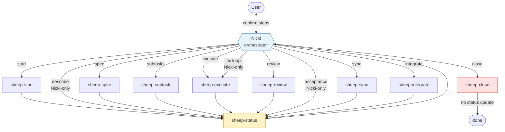

# Nicki workflow diagrams

Visual maps of the current-task pipeline as defined in `.cursor/agents/`, `.cursor/skills/nicki/routing.yaml`, and `.cursor/skills/`.

For orchestrator rules and artifact schemas, see [`NICKI.md`](NICKI.md).

---

## 1. Simple — Nicki and sheep only

### Pipeline steps

| Step | Who runs it | Default next |
| ---- | ----------- | ------------ |
| `start` | sheep-start | `describe` |
| `describe` | Nicki (Gherkin story) | `spec` |
| `spec` | sheep-spec | `subtasks` |
| `subtasks` | sheep-subtask | `execute` |
| `execute` | sheep-execute | `review` |
| `review` | sheep-review | readiness-driven |
| `acceptance` | Nicki checkpoint | `sync` |
| `fix` | Nicki → re-route | `execute` |
| `sync` | sheep-sync | `integrate` |
| `integrate` | sheep-integrate | `close` |
| `close` | sheep-close | `done` |

### Rules Nicki enforces

- After every sheep **except** `sheep-close`, Nicki auto-sends `sheep-status`.
- `sync`, `integrate`, and `close` need explicit user confirmation.
- Post-review routing from validation YAML (not review prose):
  - `ready_for_acceptance` → acceptance (sync blocked until user accepts)
  - `fix_required` → execute (`## Fix` appended to subtasks)
  - `blocked` → ask user (sync blocked)

---

## 2. Complete — Nicki, sheep, and all skills

```mermaid
flowchart TB
    subgraph UserLayer[" "]
        User([User])
    end

    subgraph NickiLayer["Nicki (readonly orchestrator)"]
        Nicki{{Nicki}}
        Routing["routing.yaml"]
        Hook["hook-contract"]
        StatusFmt["status-format.md<br/>global-status-format.md"]
    end

    subgraph SheepLayer["Sheep subagents (Nicki Task-spawns only)"]
        SS[sheep-start]
        SSpec[sheep-spec]
        SSub[sheep-subtask]
        SExec[sheep-execute]
        SRev[sheep-review]
        SSync[sheep-sync]
        Sint[sheep-integrate]
        SClose[sheep-close]
        SStat[sheep-status]
    end

    subgraph SkillsLayer["Skills (how-to manuals)"]
        StartTask["start-task"]
        SpecMaker["spec-maker"]
        SubtaskMaker["subtask-maker"]
        ExecutePlan["execute-plan"]
        ReviewExec["review-execution"]
        Validation["validation"]
        SyncTask["sync-task"]
        IntegrateTask["integrate-task"]
        CloseTask["close-task"]
        TaskArchive["task-archive"]
        CloseScope["close-scope"]
        CurrentUpdate["current-task-update"]
        ConflictRes["conflict-resolution"]
    end

    subgraph Artifacts["Key artifacts on disk"]
        GS["global-status.json"]
        ST["current-task/status.json"]
        Story["current-task/story.md"]
        SpecA["current-task/specs/slug.yaml"]
        SubA["current-task/subtasks/slug.md"]
        ExecA["current-task/executions/slug.yaml"]
        RevA["current-task/reviews/slug.yaml"]
        ValA["current-task/review-validations/rN-validation.yaml"]
        SyncA["current-task/syncs/slug.yaml"]
        IntA["current-task/integrates/slug.yaml"]
        Arch["docs/archive/slug/"]
    end

    User <-->|confirm + invoke| Nicki
    Nicki --> Routing
    Nicki --> Hook
    Nicki --> StatusFmt

    Nicki -->|start| SS
    Nicki -->|describe: draft Gherkin| SStat
    Nicki -->|spec| SSpec
    Nicki -->|subtasks| SSub
    Nicki -->|execute| SExec
    Nicki -->|review| SRev
    Nicki -->|acceptance| SStat
    Nicki -->|fix → execute| SExec
    Nicki -->|sync| SSync
    Nicki -->|integrate| Sint
    Nicki -->|close| SClose

    SS --> StartTask
    SSpec --> SpecMaker
    SSub --> SubtaskMaker
    SExec --> ExecutePlan
    SRev --> ReviewExec
    SRev --> Validation
    SSync --> SyncTask
    SSync --> ConflictRes
    Sint --> IntegrateTask
    Sint --> ConflictRes
    SClose --> CloseTask
    CloseTask --> TaskArchive
    CloseTask --> CloseScope
    SStat --> CurrentUpdate

    StartTask -->|register| GS
    StartTask --> ST
    CurrentUpdate --> ST
    SpecMaker --> SpecA
    SubtaskMaker --> SubA
    ExecutePlan --> ExecA
    ReviewExec --> RevA
    Validation --> ValA
    SyncTask --> SyncA
    IntegrateTask --> IntA
    TaskArchive --> Arch
    CloseScope -->|unregister| GS
    CloseScope -->|rm -rf worktree| Arch

    SS -.->|after| SStat
    SSpec -.->|after| SStat
    SSub -.->|after| SStat
    SExec -.->|after| SStat
    SRev -.->|after| SStat
    SSync -.->|after| SStat
    Sint -.->|after| SStat

    Nicki -.->|forwards sheep YAML| SStat
    SStat -.->|returns state| Nicki

    style Nicki fill:#e8f4fc,stroke:#2b6cb0
    style SStat fill:#fef3c7,stroke:#d97706
    style Validation fill:#f3e8ff,stroke:#7c3aed
    style Hook fill:#f0fdf4,stroke:#16a34a
```

### Skill ownership map

| Agent | Skills used | Primary writes |
| ----- | ----------- | -------------- |
| **Nicki** | `hook-contract` (reads); `routing.yaml`; status format docs | nothing (readonly) |
| **sheep-start** | `start-task` | worktree + `global-status.json` registry |
| **sheep-spec** | `spec-maker` | `current-task/specs/<slug>.yaml` |
| **sheep-subtask** | `subtask-maker` | `current-task/subtasks/<slug>.md` |
| **sheep-execute** | `execute-plan` | `current-task/executions/<slug>.yaml` + checklist ticks |
| **sheep-review** | `review-execution`, `validation` | review + validation YAML, optional next-steps |
| **sheep-sync** | `sync-task`, `conflict-resolution` | `current-task/syncs/<slug>.yaml` |
| **sheep-integrate** | `integrate-task`, `conflict-resolution` | `current-task/integrates/<slug>.yaml` |
| **sheep-close** | `close-task` → `task-archive` + `close-scope` | `docs/archive/<slug>/`; unregister; delete worktree |
| **sheep-status** | `current-task-update` | `current-task/status.json` only |

### Skills outside the pipeline diagram

| Skill | Role |
| ----- | ---- |
| `caveman` | Voice/style for markdown handoffs (e.g. archive `report.md`) — not a workflow step |
| `conflict-resolution` | Shared protocol; invoked by sync/integrate sheep when merges conflict |

### Three layers

| Layer | Owns |
| ----- | ---- |
| **Skill** | How to do one job (users can attach for ad-hoc work) |
| **Sheep** | Bind skills to disk paths, gates, and Nicki handoff YAML |
| **Nicki** | Pipeline, confirmations, forwarding sheep return YAML to `sheep-status` |

**Write boundaries:** only `sheep-start` and `sheep-close` may write `global-status.json`. Only `sheep-status` writes per-task `status.json`. Nicki never writes files or runs shell.
