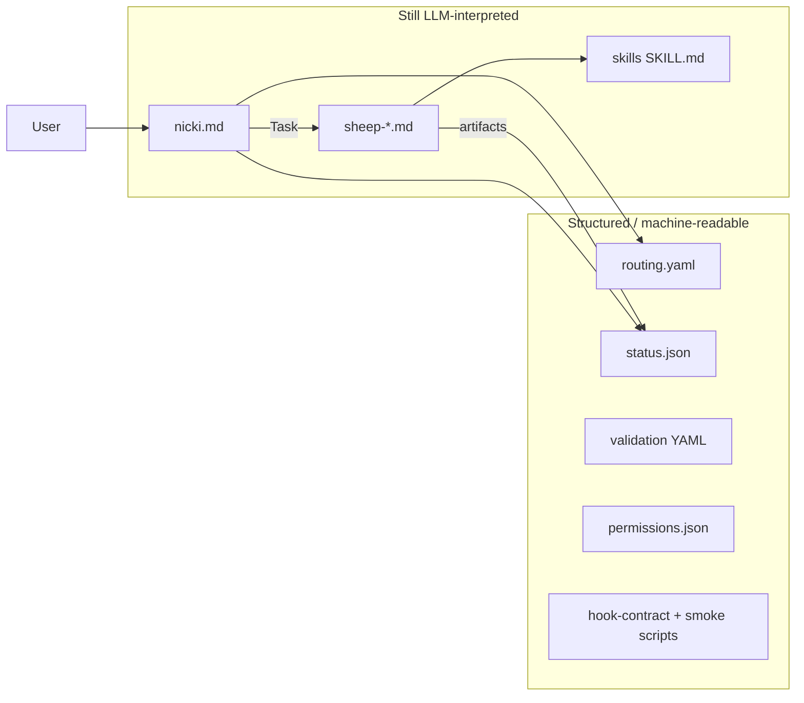
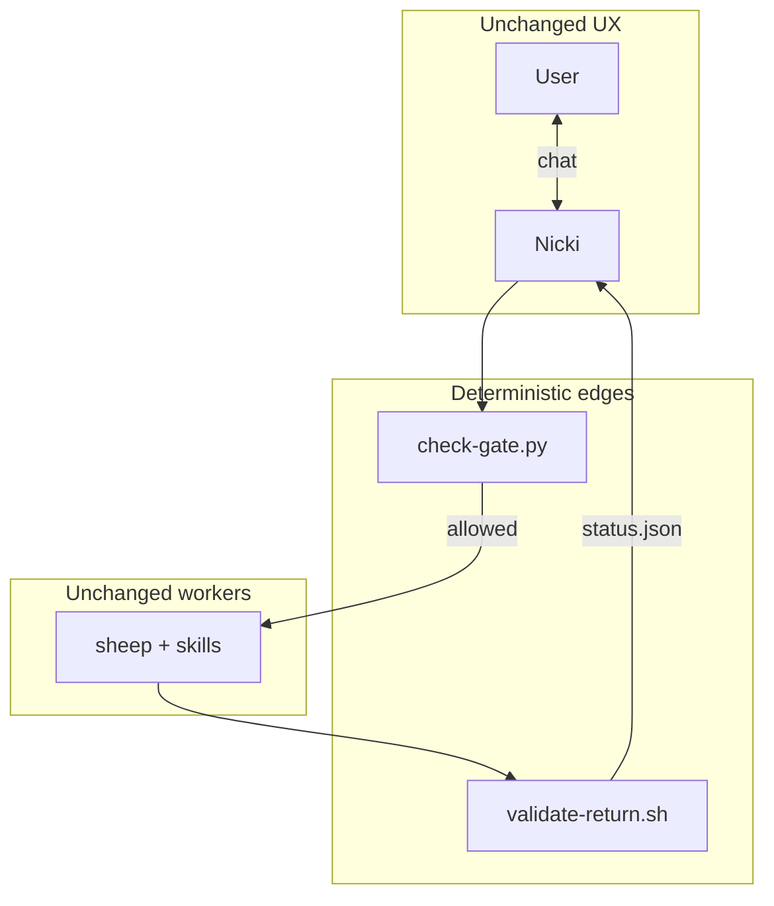

# Investigation: "Your Agent Is Just a Markdown File"

Source: [Mohsen Nasiri, Medium, May 2026](https://medium.com/@mohsenny/your-agent-is-just-a-markdown-file-we-can-do-better-0a681cb78739)

Scope: how the article's "agent as code" model applies to Nicki, and whether the trade-offs are worth it.

---

## Article thesis

Markdown-as-runtime works for doc Q&A and light tasks. Fails when the agent must guarantee sequencing, state, permissions, or side effects. Author's production QA pipeline:

| Layer | Substrate | Role |
|-------|-----------|------|
| Orchestrator | TypeScript | graph traversal, credentials, spawn, validate |
| Agent node | typed `AgentDefinition` | narrow job, `toolSet`, I/O JSON Schema |
| Tools | code modules | enforced allowlist; model cannot invent tools |
| Guidance | Markdown | injected conditionally (e.g. per-team playbook), not preloaded every turn |

LLM runs only inside a single node. It does not decide what runs next.

---

## Where Nicki sits today

Nicki is a **hybrid** — past pure "folder of MDs," not yet a typed workflow engine.



### Already aligned

| Pattern | Nicki implementation |
|---------|---------------------|
| Workflow graph not prose | `routing.yaml` — steps, gates, default next, sheep map |
| Machine state | `status.json`, `global-status.json`; disk wins over chat |
| Typed handoffs | `*-format.md` schemas; sheep return YAML in `routing.yaml` |
| Deterministic branch after review | `readiness_routing` reads validation YAML — not review markdown |
| Narrow workers | One sheep per step; skills are single-job manuals |
| Permissions as code | `permissions.json`, hook-contract, terminal allowlist |
| Markdown as data | Skills loaded only when sheep runs; Nicki does not read sheep agent files |
| Tests (minimal) | `smoke-readiness-mapping.sh`, hook smoke scripts |

### Still markdown-as-runtime

| Gap | Risk |
|-----|------|
| **Orchestrator is `nicki.md`** | Every turn re-interprets routing, gates, confirm rules |
| **User confirm is prompt policy** | Advisory to the model, not enforced |
| **No runtime schema validation** | Malformed sheep output not rejected before `sheep-status` |
| **No code runner** | Task tool is the orchestration engine |
| **Duplication** | Step logic in both `routing.yaml` and `nicki.md` |
| **Mixed gate checks** | Some JSON fields; others prose the model must honor |

Article punchline applies to Nicki's **orchestrator**: skip git confirm or misroute after review → "the model decided to."

---

## How the article maps onto Nicki

**Orchestrator becomes code** (`docs/PLAN.md` sketches `bin/nicki`):

```
status.json + routing.yaml → gate (code) → spawn sheep
  → validate return YAML → sheep-status updates status.json → next node
```

`nicki.md` becomes optional UX. `routing.yaml` needs an executor, not more prose.

**Sheep become `AgentDefinition`-shaped:** `id`, `toolSet` from `permissions.json`, I/O schemas from `*-format.md`, slim prompt from sheep MD. Skills stay Markdown — playbook in sheep, not orchestrator.

**Validate at boundaries:**

| Boundary | Validate |
|----------|----------|
| sheep → return YAML | `sheep_return_contract` fields |
| sheep → artifact | spec/execution/validation YAML vs format docs |
| review → route | `readiness.status` enum only |
| sync / integrate | artifact pointer exists; readiness not `fix_required` |

Documented + partially smoke-tested today. Not enforced every run.

**Context + permissions:** Sheep auto-load task paths; runner would formalize injection. `permissions.json` + hooks depend on Cursor wiring; code runner enforces before spawn.

Do **not** rewrite skills or sheep into TypeScript. Markdown for *how*; code for *when* and *whether*.

---

## Trade-offs

| Gains | Costs |
|-------|-------|
| Git steps cannot be skipped by orchestrator drift | Full runner + SDK is large (PLAN.md "build later") |
| Debuggable gate failures vs reading chat | Schema tax on every `*-format.md` change |
| Orchestration stops paying LLM tokens | CLI feels colder than chat Nicki unless wrapped |
| Testable routing + fixture status files | Gates on *presence* ≠ artifact *quality* |
| Typed edges for multi-project CLI | Article targets 24/7 QA; Nicki is human-in-the-loop dev |

---

## Fit verdict

| Question | Answer |
|----------|--------|
| Article relevant? | **Yes.** routing.yaml, JSON state, validation-driven branches. |
| Nicki "just markdown"? | **Partially.** Workers/skills MD; pipeline skeleton not; orchestrator still is. |
| Full article architecture now? | **No.** Cost > benefit while Task + human confirm is the target. |
| Directionally correct? | **Yes.** PLAN.md CLI + schemas, incremental. |

*"What happens when the model doesn't follow it?"* — recoverable for spec/execute/review; real consequences for sync/integrate/close. Code gates there first.

**Avoid:** long-lived Node server, rewriting skills/sheep to TS, cold CLI replacing chat Nicki, big-bang architecture.

---

## Direction

### No server

Nicki does not need the article's long-lived QA service. Path is **invoke-and-exit** scripts and hooks — no port, no daemon.

| Approach | When |
|----------|------|
| LLM Nicki + Task (today) | Each chat turn |
| `check-gate.py` / `nicki gate` | Before risky step |
| `nicki continue` CLI | One-shot read → decide → spawn |
| Cursor hooks | On tool use |
| Return validator in `sheep-status` | After each sheep |

Server only if Nicki leaves IDE (CI webhooks, queues, headless farm) — PLAN.md phase 3+.

### Code at the edges



**Focus:** working pipeline first, guardrails second, trimming last. Script owns gates when P2 ships; trim only after harness is proven.

Disk consent deferred.

### Three goals (always)

All three apply to every task. Priority order breaks **conflicts** only:

1. Correct functioning → 2. Harness / guardrails → 3. Trimming

See [`tasks.md`](tasks.md).

### What Nicki becomes (after P2 + P3)

| Today | After P2 harness (+ P3 trim) |
|-------|----------|
| Read `routing.yaml`, interpret gates | Run `check-gate.py`; show script `reason` on fail |
| Readiness table in prompt | Script reads validation YAML |
| Sheep map table in prompt | Script returns `sheep` name |
| Numbered workflow in prompt | `status.json` `next_step` + script |
| Load spec/validation for gate checks | Script loads when needed |

Nicki keeps: persona, Gherkin `describe`, transition card, chat confirm, `sheep-status` relay.

**Tasks:** [`tasks.md`](tasks.md) — gate script, prompt trim, worktree script, defer list.

### One-line takeaway

**Script routes and gates; Nicki talks.** See [`tasks.md`](tasks.md).

---

## References

`.cursor/agents/nicki.md` · `.cursor/skills/nicki/routing.yaml` · `docs/NICKI.md` · `docs/WORKFLOW-DIAGRAMS.md` · `docs/PLAN.md` · `docs/tasks.md` · `.cursor/permissions.json` · `.cursor/skills/hook-contract/SKILL.md` · [`investigation-complexity.md`](investigation-complexity.md)
